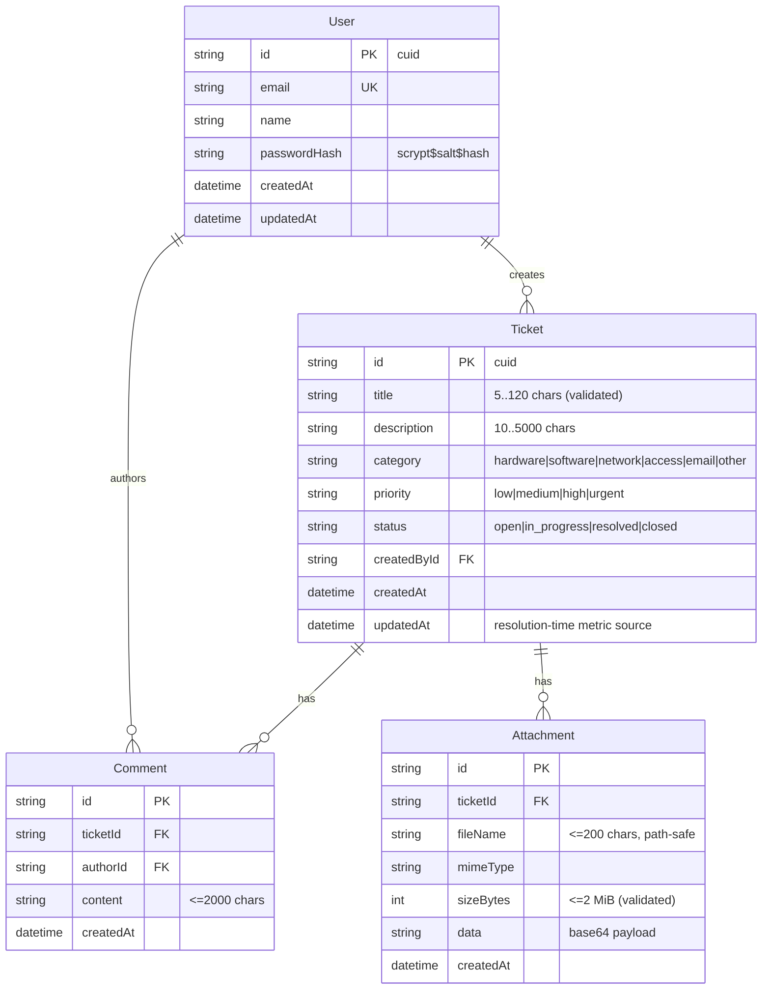

# ServiceDesk — Master Project Architecture Document (PAD) v1.0

**Classification:** Internal Engineering Reference
**Status:** DEFINITIVE, PRODUCTION-LOCKED BLUEPRINT
**Companion Document:** README.md (user-facing), AGENTS.md (agent instructions), CLAUDE.md (contribution standards)
**Last Updated:** 2026-10-09
**Audience:** Senior Engineers, Tech Leads, DevOps, and Onboarding Engineers
**Rule:** Every architectural decision in this document traces to a specific rationale. Nothing is here "because it's popular."

---

## Table of Contents

1. [System Overview & Decisions](#1-system-overview--decisions)
2. [High-Level System Topology](#2-high-level-system-topology)
3. [Application Architecture](#3-application-architecture)
4. [Data Architecture](#4-data-architecture)
5. [Design System Reference](#5-design-system-reference)
6. [Security Architecture](#6-security-architecture)
7. [Testing Strategy](#7-testing-strategy)
8. [Build & Deployment](#8-build--deployment)
9. [Developer Handbook](#9-developer-handbook)
10. [Known Issues & Outstanding Tasks](#10-known-issues--outstanding-tasks)
11. [Key Files Reference](#11-key-files-reference)
12. [Glossary](#12-glossary)

---

## 1. System Overview & Decisions

### 1.1 Document Metadata & Purpose

ServiceDesk is an IT support ticketing portal — a visual-parity, feature-superset clone of the base44 ServiceDesk reference application, rebuilt as a single deployable Next.js process with a SQLite database. This PAD is the definitive engineering reference for onboarding, debugging, and replication: it captures the layer model, the data contract, the security architecture, and the hard-won framework quirks that are not obvious from filenames.

**How to use it:** a new engineer should read §1–§4 before touching code; anyone debugging styling/auth/navigation should read §3.3, §5, and §6 first; operators should read §8–§9.

### 1.2 Technology Stack Summary

| Layer | Technology | Version | Key Rationale |
|---|---|---|---|
| Web framework | Next.js (App Router, `output: standalone`) | 16.4.0 | One-process deployment; server-rendered auth guard; route handlers replace a separate API tier |
| UI runtime | React | 19.3.0 | Required by Next 16; no `forwardRef` needed in new code |
| Language | TypeScript (strict) | 5.9.3 | Type-safe contracts across pages, API, and tests |
| Styling | Tailwind CSS (CSS-first `@theme inline`) | 4.3.3 | Matches the reference's utility-class DOM; v4 removes the config file entirely |
| Components | shadcn/ui on Radix primitives | vendored in `src/components/ui` | The reference app uses the same primitives (`data-sidebar` DOM) — parity at the component level |
| Icons | lucide-react | 0.525.0 | Reference-matched icon set (`lucide-users`, `lucide-circle-alert`, …) |
| ORM | Prisma | 6.19.3 | Schema-as-code + typed client; CLI's schema-relative `file:` URL rule anchors the db-path contract |
| Database | SQLite | — | Zero-config single-file DB; the reference's data model fits comfortably |
| Auth | Custom HMAC cookie sessions + Node scrypt | — | Email/password only; no supply-chain surface; fully unit-tested |
| Unit tests | Vitest | 5.0.3 | Fast node-environment tests for pure seams |
| E2E tests | Playwright (Chromium) | 1.64.0 | Drives the PRODUCTION standalone build, not a dev server |
| Runtime | Bun (dev/seed) / Node ≥ 20 (server) | 1.3.x / ≥20 | Bun runs TS seeds natively; the standalone server is plain Node |

### 1.3 Architecture Decision Records (ADRs)

**ADR-001: Clone the reference with Next.js App Router + route-group auth guard**

- **Context:** The reference is a base44 SPA with client-side routing and JWT-in-localStorage auth. The clone must reproduce its routes (`/dashboard`, `/submitticket`, `/mytickets`, `/ticketdetails?id=`) and its visual DOM while being a maintainable, deployable artifact.
- **Decision:** Next.js 16 App Router. Public routes (`/login`, `/signup`, `/forgotpassword`) are standalone pages; all authenticated pages live in the `src/app/(app)/` route group whose `layout.tsx` resolves the session server-side and redirects unauthenticated visitors to `/login` before any page markup streams.
- **Rationale:** Server-side guarding removes the flash-of-login-page and keeps auth logic in one place. The route group preserves the reference's URL shapes without a path prefix.
- **Consequences:** Pages under `(app)` are client islands (they hydrate onto the server shell) — acceptable because the interactivity (filters, forms, comments) is inherently client-side. The guard lives in exactly one file.
- **Alternatives Rejected:** A `middleware`/`proxy.ts` gate (duplicates the session resolution and complicates the cookie flow for no gain at this scale); pure SPA with client auth (loses SSR guard, weaker parity tooling).

- **Session-19 amendment (the proxy as a UX decoration layer):** `src/proxy.ts` now exists — but it is NOT the auth gate ADR-001 rejected. It checks cookie PRESENCE only (no HMAC, no session resolution) on the four `(app)` routes and decorates the cookie-less bounce with `?from_url=<absolute url>` (the reference's measured deep-link contract — an unauthenticated `/ticketdetails?id=X` returns to that ticket after sign-in, not the dashboard). The `(app)` layout guard remains the authoritative verifier; `safeRedirectTarget` (`src/lib/redirect.ts`) validates the target at use time (same-origin, auth-pages rejected, `/dashboard` fallback — the open-redirect guard). The ADR's concern (duplicated session resolution) is specifically absent from the proxy.

**ADR-002: SQLite via Prisma, one file at `<repo>/db/custom.db`, resolved by a tested seam**

- **Context:** The deployment must be one process with zero external services, and `DATABASE_URL="file:../db/custom.db"` (schema-relative) must point at the same file for the Prisma CLI, `next dev`, `next build`, and the standalone server — which `process.chdir`s into `.next/standalone`.
- **Decision:** `prisma/schema.prisma` + `src/lib/db-path.ts`. Relative `file:` URLs resolve against the first "anchor" directory containing `prisma/schema.prisma` (module repo root → standalone-repo detector → CWD fallback); absolute and non-SQLite URLs pass through. The Prisma client singleton (`src/lib/db.ts`) sets `process.env.DATABASE_URL` via this seam before instantiation.
- **Rationale:** The Prisma CLI anchors relative `file:` URLs against the schema file; the runtime seam replicates that exact rule, so all four processes open ONE database file regardless of working directory.
- **Consequences:** 15 unit tests pin the contract (`tests/db-path.test.ts`). Production deployments may use absolute paths, which pass through untouched. npm scripts additionally pin `DATABASE_URL` inline because an ambient exported variable overrides `.env` files.
- **Alternatives Rejected:** Always-absolute paths (breaks the "clone and run" story); Postgres (violates the zero-service constraint; `skills/rootless-postgresql` exists if the data model outgrows SQLite).

**ADR-003: Hand-rolled HMAC cookie sessions + scrypt instead of an auth library**

- **Context:** The app needs email/password auth only. The reference uses base44's platform JWT-in-localStorage, which is not reproducible and is weaker than httpOnly cookies.
- **Decision:** `src/lib/auth.ts` — sessions are `base64url(JSON payload).HMAC-SHA256(payload)` in an httpOnly, SameSite=Lax cookie (7-day TTL, `Secure` in production, `AUTH_SECRET` signing key); passwords hash with Node `scrypt` (64-byte key, 16-byte per-user salt, constant-time verification). Login/signup/forgot-password are rate-limited per IP (10/15 min, in-memory sliding window).
- **Rationale:** ~150 auditable lines replace a dependency tree; every primitive (sign, verify, tamper, expiry, hashing, rate limit) is unit-tested. httpOnly cookies remove the XSS token-theft class entirely.
- **Consequences:** The rate limiter is per-process (fine for single-server deploys; documented limitation for horizontal scale). Password reset is request-logging only (no mail transport configured) — the API response is enumeration-safe.
- **Alternatives Rejected:** NextAuth/Auth.js (OAuth machinery we do not need); Better Auth (adds a dependency for the same contract); storing tokens in localStorage (XSS-exposed, matches neither our threat model nor production-grade standards).

**ADR-004: Tailwind v4 CSS-first tokens with `@theme inline`, measured-reference styling**

- **Context:** Visual parity with the reference is a hard requirement, and the reference's DOM is utility-class based (shadcn). Tailwind v4 changed the configuration model.
- **Decision:** No `tailwind.config.js`. `src/app/globals.css` declares semantic tokens as `@theme inline { --color-*: var(--*) }` over a literal-hex `:root` palette (light + dark). All reference-measured values (sidebar `#fafafa`, cyan→blue gradients, amber/emerald accents, navy scale) live in that one file.
- **Rationale:** `@theme inline` is the officially supported pattern for referencing `:root` variables; a bare `@theme` with `var()` chains is silently dropped by the v4 build (pinned in `docs/Tailwind-V4-Validation-Report.md` and the scandihaven hard lessons). Utilities then compose the reference's exact classes.
- **Consequences:** Two cascade rules must be respected forever: (1) never regress `inline`; (2) variant utilities (e.g. `data-[active=true]:text-*`) outrank plain utilities — overrides on variant-styled primitives need the `!` modifier (see the `text-white!` comment in `app-sidebar.tsx`).
- **Alternatives Rejected:** Tailwind v3 + config file (fights the toolchain's current default); CSS modules (breaks utility-class parity with the reference DOM).

**ADR-005: Superset features stay additive to the reference surface**

- **Context:** The clone must be a functional superset (production-ready) while preserving visual parity.
- **Decision:** Additions are: working signup, forgot-password request, file attachments (2 MiB × 3, base64 in SQLite, streamed downloads), owner-side status transitions, search/filter/sort/scope on My Tickets, comment threads, average-resolution-time metric, health endpoint, rate limiting, security headers, toasts, skeletons. None of them alter reference-visible structure — they extend existing cards/panels.
- **Rationale:** Every addition lives where the reference has a stub or an obvious gap; the E2E suite pins both the reference contracts (mobile sheet, gradient active nav) and the additions.
- **Consequences:** The "All Tickets" scope toggle and the status dropdown are visible superset affordances — documented here as intentional deviations.
- **Alternatives Rejected:** Admin/agent workflows (scope creep beyond the reference's user-facing portal).

**ADR-006: E2E drives the production standalone build, not the dev server**

- **Context:** Dev-mode behavior differs from production (dev overlay, Turbopack chunking), and the standalone `server.js` has its own working-directory quirks.
- **Decision:** `playwright.config.ts` boots `bun .next/standalone/server.js` on :3100 with an isolated `db/e2e.db` (schema pushed + seeded by the global setup) and one shared authenticated `storageState` produced by a setup project.
- **Rationale:** Tests the exact artifact that ships; the isolated DB keeps runs deterministic; the single sign-in respects the rate limiter budget.
- **Consequences:** `bun run build` must precede `test:e2e`. The standalone-repo detector in `db-path.ts` is exercised for real on every run.
- **Alternatives Rejected:** Testing against `next dev` (misses standalone-specific defects — exactly the class this project's db-path work exists for).

---

## 2. High-Level System Topology

```mermaid
flowchart TB
    subgraph Client
        B[Browser - desktop / mobile]
    end
    subgraph Edge
        PX[Reverse proxy - optional\nforwards X-Forwarded-Proto]
    end
    subgraph App["Single Next.js process (standalone server.js)"]
        RSC[Server Components\n(app) layout guard · root layout]
        PAGES[Client page islands\ndashboard · submitticket · mytickets · ticketdetails\nlogin · signup · forgotpassword]
        API[Route handlers /api/*\nauth · tickets · comments · attachments\nstats · health]
        AUTH[auth.ts\nHMAC sessions · scrypt · rate limit]
        DBP[db-path.ts + db.ts\nURL resolution · Prisma singleton]
    end
    subgraph Data
        SQLite[(SQLite file\ndb/custom.db)]
    end
    B --> PX --> RSC
    RSC --> PAGES
    B -->|fetch JSON| API
    API --> AUTH
    API --> DBP
    RSC --> AUTH
    AUTH --> DBP
    DBP --> SQLite
```

**Runtime characteristics:** one process, ~50 MiB RSS class, SQLite in WAL-less file mode. Scaling is vertical (SQLite handles this workload comfortably to thousands of tickets); the first horizontal-scale milestone requires moving the rate limiter to shared storage and the database to Postgres (`skills/rootless-postgresql` documents the path).

**Key constraints:** the process must start from the repo root (npm scripts guarantee the CWD the db-path and standalone trace rely on); `X-Forwarded-Proto` must reach it behind TLS-terminating proxies so cookie `Secure` attributes derive correctly.

---

## 3. Application Architecture

### 3.1 The Layer Model

```
Layer 0: Pages & chrome — src/app/** (route group guard, client islands, shadcn ui/)
         Rule: no domain logic; every mutation goes through Layer 2; auth checks never appear here.
Layer 1: API route handlers — src/app/api/**
         Rule: validate input (Layer 3), resolve the session (Layer 3), call Prisma,
               return { error, errors? } JSON with a correct status code. Never throw across the boundary.
Layer 2: Data access — src/lib/db.ts (Prisma singleton) + prisma/schema.prisma
         Rule: all queries through the singleton; no direct @prisma/client imports in app code.
Layer 3: Domain seams — src/lib/{auth,validation,constants,utils,db-path}.ts
         Rule: pure (no React, no DB in the pure parts), unit-tested, single source of truth
               for the ticket vocabulary, session crypto, input rules, and the db-path contract.
```

The golden rule: **domain rules live in Layer 3, are consumed identically by Layers 0–2, and are pinned by unit tests** — the UI never re-implements validation, and the API never re-defines the vocabulary.

### 3.2 Annotated Directory Structure

```
service-desk/
├── prisma/
│   ├── schema.prisma            ← User/Ticket/Comment/Attachment; relative file: URL anchors here
│   └── seed.ts                  ← idempotent (upsert-by-email, existence-by-title) demo corpus
├── db/                          ← SQLite file lands here (custom.db gitignored; .gitkeep tracked)
├── src/
│   ├── app/
│   │   ├── (app)/               ← AUTHENTICATED route group
│   │   │   ├── layout.tsx       ← server session guard + ToastProvider + sidebar chrome
│   │   │   ├── dashboard/       ← stat cards, performance metrics, recent tickets, bottom CTA
│   │   │   ├── submitticket/    ← form + emoji category select + attachment upload
│   │   │   ├── mytickets/       ← search + status/priority/sort/scope controls + card list
│   │   │   └── ticketdetails/   ← description, comments, ticket info panel, owner status control
│   │   ├── api/
│   │   │   ├── auth/{login,signup,logout,me,forgot-password}/route.ts
│   │   │   ├── tickets/route.ts                ← GET list (filters) + POST create
│   │   │   ├── tickets/[id]/route.ts           ← GET detail + PATCH owner status
│   │   │   ├── tickets/[id]/comments/route.ts  ← POST comment (tx: comment + touch updatedAt)
│   │   │   ├── tickets/[id]/attachments/[attachmentId]/route.ts ← streamed download
│   │   │   ├── stats/route.ts                  ← mine + global counts + avg resolution
│   │   │   └── health/route.ts                 ← liveness + DB probe
│   │   ├── login/ · signup/ · forgotpassword/  ← standalone auth cards
│   │   ├── layout.tsx           ← root metadata/head (system font stack, OG images, viewport), globals.css
│   │   ├── page.tsx             ← "/" → /dashboard | /login
│   │   └── globals.css          ← Tailwind v4 tokens (@theme inline) + light/dark palettes
│   ├── components/
│   │   ├── ui/                  ← shadcn primitives: sidebar, sheet, select, dialog-free set,
│   │   │                          button, card, input, label, textarea, badge, avatar, separator,
│   │   │                          skeleton, tooltip, toast(radix)
│   │   ├── app-sidebar.tsx      ← nav (gradient active) + QUICK STATS + user footer + logout
│   │   ├── app-sidebar-chrome.tsx ← SidebarProvider + SidebarInset + mobile header (md:hidden)
│   │   ├── ticket-bits.tsx      ← Status/Priority/Category badges + TicketCard (reference classes)
│   │   └── toast.tsx            ← Radix toast viewport + useToast context
│   ├── hooks/
│   │   └── use-mobile.ts        ← useSyncExternalStore media query (no effect setState)
│   └── lib/
│       ├── auth.ts              ← sign/verify session, scrypt hash/verify, rate limit, getSession
│       ├── constants.ts         ← ticket vocabulary + emoji/label maps + attachment limits
│       ├── validation.ts        ← ticket/comment/signup/login/attachment guards
│       ├── utils.ts             ← cn, formatDateTime ("Oct 9, 2026 at 12:47 AM"), formatDuration
│       ├── db-path.ts           ← the DATABASE_URL resolution contract (pure, tested)
│       ├── db.ts                ← Prisma singleton (resolves URL via db-path first)
│       └── __tests__/           ← auth, domain (constants+validation), utils unit tests
├── tests/
│   ├── db-path.test.ts          ← 15 tests pinning the URL contract
│   └── e2e/                     ← auth, dashboard, tickets, mobile-navigation specs
│                                  + auth.setup.ts (shared session) + global-setup.ts (e2e.db)
├── scripts/
│   ├── smoke-test.sh            ← API surface on a throwaway standalone server
│   ├── probe-gradients.mjs      ← Playwright probe: sidebar gradients via UI login
│   └── gradient-test{,2}.mjs    ← isolated oklab/lab() gradient rendering experiments
├── docs/
│   ├── DEPLOYMENT.md            ← production build/run/env contract
│   ├── Tailwind-V4-Validation-Report.md ← the v3→v4 facts behind ADR-004
│   ├── how-to-git-push-using-ssh-wrapper_SKILL.md + ssh_git_wrapper_v3.py
│   ├── screenshots/             ← 7 dev-server captures (desktop ×5, mobile ×2)
│   └── …                        ← prompts, skills inventory (repo scaffolding provenance)
├── skills/                      ← the in-repo skill catalog used to build this clone
├── next.config.ts               ← standalone + tracing root + devIndicators:false + headers
├── vitest.config.ts · playwright.config.ts · eslint.config.mjs · tsconfig.json
└── package.json                 ← scripts pin DATABASE_URL inline (see ADR-002)
```

### 3.3 Critical Code Patterns

**Pattern 1 — The session guard (server) + client islands**

```tsx
// src/app/(app)/layout.tsx — the ONLY auth check in the chrome
export default async function AppGroupLayout({ children }) {
  const user = await getCurrentUser();      // lib/auth.ts → cookies() (async in Next 16)
  if (!user) redirect("/login");            // streams before any page markup
  return (
    <ToastProvider>
      <AppSidebarChrome user={user}>{children}</AppSidebarChrome>
    </ToastProvider>
  );
}
```

*Why this pattern:* one guard, zero duplicated checks, no flash of unauthenticated content. Pages stay `"use client"` islands that hydrate onto the shell — the reference app's exact interactive behavior with server-side safety.

**Pattern 2 — Validated-string enums as the single vocabulary**

```ts
// src/lib/constants.ts (excerpt) — SQLite has no enums; this is the contract
export const TICKET_STATUSES = ["open", "in_progress", "resolved", "closed"] as const;
export type TicketStatus = (typeof TICKET_STATUSES)[number];
export function isTicketStatus(v: unknown): v is TicketStatus { /* … */ }
```

*Why this pattern:* the API, the UI badges (`STATUS_BADGE_CLASSES`), the filters, and the E2E assertions all import the same arrays — adding a status is a one-file change plus tests, with compile-time safety everywhere else.

**Pattern 3 — The Tailwind v4 variant-cascade override (load-bearing `!`)**

```tsx
// src/components/app-sidebar.tsx — active nav item
isActive
  ? "bg-gradient-to-r from-cyan-500 to-blue-600 text-white! shadow-lg shadow-cyan-500/30"
  : "text-slate-600 hover:bg-gradient-to-r hover:from-cyan-50 hover:to-blue-50 hover:text-cyan-700"
```

*Why this pattern:* the shadcn `SidebarMenuButton` base carries `data-[active=true]:text-sidebar-accent-foreground`; Tailwind v4 orders variant utilities after plain ones, so a plain `text-white` silently loses. The `!` modifier is pinned by an E2E computed-style assertion (`mobile-navigation.spec.ts`), and the comment explains the why for the next maintainer.

**Pattern 4 — Cancellable client fetches on route change**

```tsx
// src/components/app-sidebar.tsx — QUICK STATS refresh (excerpt)
React.useEffect(() => {
  let cancelled = false;
  fetch("/api/stats").then((r) => (r.ok ? r.json() : null)).then((data) => {
    if (!cancelled && data?.global) setStats(/* … */);
  }).catch(() => { /* non-critical; skeleton stays */ });
  return () => { cancelled = true; };
}, [pathname]);
```

*Why this pattern:* stats stay live per navigation without a server-state library; the cancel flag prevents a stale response from a previous route overwriting the current one; failures degrade to the skeleton rather than an error boundary.

**Pattern 5 — Mobile off-canvas sheet with auto-close on navigate**

```tsx
<Link href={item.href} onClick={() => setOpenMobile(false)}> … </Link>
```

*Why this pattern:* the shadcn Sidebar renders as a Radix Sheet on mobile but does not close itself on navigation — without this line the overlay traps the user after every nav tap. The behavior is pinned by the E2E spec ("tapping a nav link navigates AND auto-closes the sheet").

---

## 4. Data Architecture

### 4.1 Database Schema



Indexes: `Ticket(createdById, createdAt DESC)` (My Tickets + Recent Tickets), `Ticket(status)` (global quick stats), `Comment(ticketId, createdAt)` (thread order), `Attachment(ticketId)`.

### 4.2 Persistence Strategy

- **One file, four processes:** the Prisma CLI, `next dev`, `next build`, and the standalone server all open `<repo>/db/custom.db` through the `db-path.ts` anchor rule (ADR-002). Migrations are `prisma db push` for this scale; the schema is forward-only in practice (additive columns first, backfill, then drop).
- **Seeding is idempotent:** users upsert by email (never overwriting an existing password hash); tickets skip on title match. The E2E global setup reuses it against `db/e2e.db`.
- **Attachments in SQLite:** base64 columns capped at 2 MiB × 3 per ticket keep the deployment single-file; the download route streams bytes with a sanitized `Content-Disposition`. If attachment volume grows, the documented upgrade is object storage + a URL column.

---

## 5. Design System Reference

### 5.1 Typographic System

- **Typeface: the system stack** (session-5 re-measure — the reference loads NO webfont; `--font-sans` is pinned in `@theme inline` to `ui-sans-serif, system-ui, …`; do NOT reintroduce next/font Inter). Smoothing left at `auto` (no `antialiased`).
- **Scale:** page titles `text-4xl font-bold tracking-tight` with `text-lg text-slate-600` subtitles (reference scale, session 2); card titles `text-lg font-semibold`; stat values `text-4xl font-bold` with proportional digits (no `tabular-nums` — the reference renders proportional); body `text-sm text-slate-600`; micro-labels `text-xs uppercase tracking-wider text-slate-500` (sidebar group labels).

### 5.2 Color Tokens

| Token | Light | Usage |
|---|---|---|
| `--background` | `#ffffff` | Body base (white — stock, session 9); the visible slate-50 page base comes from the gradient wrappers (`from-slate-50 via-white to-blue-50/30`) |
| `--sidebar` | `#fafafa` | Sidebar panel — measured, NOT white |
| `--primary` / `--ring` | `#171717` / `#0a0a0a` | Near-black pair (stock shadcn, sessions 6+9): `--primary` drives every `hover:bg-primary/80` badge to the dark `rgba(23,23,23,0.8)` on hover; focus rings near-black; cyan accents come from explicit `*-cyan-500` utilities |
| `--border` / `--input` | `#e5e5e5` | Neutral-200 (stock, session 9) — every default-`border` Card/control edge; the desktop sidebar edge overrides with explicit `border-slate-200/60` |
| `--foreground` | `#0a0a0a` | Near-black (stock, session 9) — the outline CategoryBadge text + inherited card text |
| `--sidebar-ring` | `#3b82f6` | Blue-500 (stock, session 9) — the nav-item + group-label keyboard focus rings |
| `--navy-950/900/800` | `#0a1628/#0f2744/#1a3a5c` | Login logo badge, dark theme surfaces |
| `--amber-500` | `#f59e0b` | "Open" quick-stat badge |
| `--emerald-500` | `#10b981` | Resolved accents, success toasts |

Session-9 note: the reference's entire `:root` is verbatim stock shadcn (zinc neutrals, near-black primary, blue-500 sidebar ring) — verified by a full-block token diff, both sites resolved to RGB. The remainder of the family (secondary/muted/sidebar-*) matches stock zinc too, though it renders nowhere today (unused components / defeated by call-site classes).

Badge pairs (status): open `bg-amber-100 text-amber-800 border-amber-300`; in_progress `bg-blue-100 text-blue-700`; resolved `bg-emerald-100 text-emerald-800`; closed `bg-slate-100 text-slate-600`. Priority: low slate, medium blue, high orange, urgent red. All measured from the reference DOM.

### 5.3 Component Primitives

shadcn/ui (New York flavor) vendored in `src/components/ui/` — **sidebar** (with its Sheet-based mobile representation and `useSidebar` context) is the keystone: it reproduces the reference's `data-sidebar` attribute DOM, which is what the E2E specs assert against. Select, Tooltip, and Toast are Radix-portal components; their content renders in portals (assert accordingly in tests).

### 5.4 Motion / Animation

- Cards/links: `transition-all duration-300` + hover lift (`hover:shadow-xl`), icon-tile scale on group hover (`group-hover:scale-110`), ticket-card arrow slide (`group-hover:translate-x-1`).
- Entrance animation (session 3, measured from the reference's framer-motion): `animate-rise-in` — `opacity 0→1` + `translateY(20px)→0`, 0.3 s `cubic-bezier(0.34, 1.56, 0.64, 1)` (≈ a ~310 ms spring with ~12% overshoot, no stagger) on dashboard stat cards + recent rows, mytickets cards, the submit form card, and the detail back+grid wrapper.
- Mobile sheet: `slide-in-from-left` 500 ms open / 300 ms close (E2E waits 700 ms before geometry assertions).
- Decorative stat-card circles: `opacity-10` corner gradient scaling to 150% over 500 ms on hover.
- `prefers-reduced-motion` is honored globally (globals.css) and on the rise-in entrance utility — see §10 (resolved session 3).

---

## 6. Security Architecture

### 6.1 Security Rules

| Rule | Enforcement |
|---|---|
| Sessions are unforgeable | HMAC-SHA256 over the payload; `timingSafeEqual` verification (unit-tested tamper/expiry cases) |
| Passwords are never reversible | scrypt + per-user salt; constant-time compare; hash format verified on read |
| Cookies are unreachable from JS | `httpOnly` + `SameSite=Lax` + `Secure` in production (`sessionCookieOptions()`) |
| Auth endpoints resist brute force | Per-IP sliding-window rate limit (10/15 min) with `Retry-After` on 429 |
| Every authenticated route checks the session | `(app)` layout guard (server) + per-request `getCurrentUser()` in every handler |
| Ticket mutations are owner-scoped | PATCH refuses non-owners with 403; list scope defaults to `mine` |
| No account enumeration | forgot-password returns an identical generic message; login errors are identical for unknown email and wrong password |
| Input is validated before use | `src/lib/validation.ts` guards (lengths, vocabulary, email shape, attachment size/count/filename/MIME — the closed allowlist, s23) on every mutating handler |
| Attachments cannot escape the download route | Filename sanitized (`[^\w.\- ]` → `_`) for `Content-Disposition`; size capped at upload |
| SQL injection is structurally impossible | All queries via Prisma; no string-built SQL exists |
| Clickjacking/mimetype sniffing blocked | `X-Frame-Options: DENY`, `X-Content-Type-Options: nosniff`, `Referrer-Policy`, `Permissions-Policy` (next.config.ts headers) |
| Secrets never enter the tree | `.env` gitignored; ssh wrapper shreds key material; pre-commit habit documented in CLAUDE.md |

### 6.2 Security Utilities Inventory

`src/lib/auth.ts` (sessions, hashing, rate limiting, client IP extraction), `src/lib/validation.ts` (all input guards), `src/app/api/tickets/[id]/attachments/[attachmentId]/route.ts` (download sanitization), `next.config.ts` (security headers), `docs/ssh_git_wrapper_v3.py` (secret-free push flow).

### 6.3 Authentication & Authorization

Single role today: **authenticated user**. Ownership is the authorization unit — a user reads any ticket (mirroring the reference's shareable detail URLs) but may only transition tickets they created. There is no admin role by design (ADR-005); introducing agents/admins would add an `isAgent` flag plus a guarded transition path, not a new auth system.

### 6.4 Threat Model (key vectors)

| Vector | Mitigation |
|---|---|
| Session forgery/tampering | HMAC + constant-time verify (unit-pinned) |
| XSS stealing tokens | No tokens in JS-reachable storage (httpOnly cookies); React auto-escaping; no `dangerouslySetInnerHTML` |
| Brute-force login/signup/reset | Shared per-IP rate limiter; E2E budgeted to stay under it |
| Ownership bypass via API | Server-side `createdById` comparison on every mutation |
| Malicious uploads | Size/count caps, MIME recorded but content streamed with `Content-Disposition: attachment` (never inline), path-safe filenames |
| Open redirect / CSRF surface | No redirect params exist; SameSite=Lax cookies; mutations are JSON POSTs (not form-encodable cross-site) |
| Secret leakage via repo | `.env` ignored; wrapper-managed keys; documented pre-commit scan habit |

---

## 7. Testing Strategy

### 7.1 Test Distribution

| Category | Files | Tests | Location | Framework |
|---|---|---|---|---|
| Unit — auth (session/crypto/rate-limit) | 1 | 11 | `src/lib/__tests__/auth.test.ts` | Vitest |
| Unit — the from_url redirect-target guard (s19) | 1 | 9 | `src/lib/__tests__/redirect.test.ts` | Vitest |
| Unit — domain (constants + validation incl. the s23 attachment-MIME allowlist + the s24 parseListParams pagination seam + the s25 parseListFilters vocabulary seam + the s26 parseListSearch literal-search seam) | 1 | 42 | `src/lib/__tests__/domain.test.ts` | Vitest |
| Unit — utils (date/duration formatting incl. `formatDate`; timezone-pinned at UTC — s15) | 1 | 10 | `src/lib/__tests__/utils.test.ts` | Vitest |
| Unit — db-path URL contract | 1 | 15 | `tests/db-path.test.ts` | Vitest |
| E2E — auth surface (logged-out incl. the s19 deep-link contract + the s20 reset-detour pin) | 1 | 9 | `tests/e2e/auth.spec.ts` | Playwright |
| E2E — dashboard (incl. clean-hydration pin) | 1 | 8 | `tests/e2e/dashboard.spec.ts` | Playwright |
| E2E — ticket lifecycle | 1 | 5 | `tests/e2e/tickets.spec.ts` | Playwright |
| E2E — mobile + desktop navigation | 1 | 9 | `tests/e2e/mobile-navigation.spec.ts` | Playwright |
| E2E — visual parity (session-2 through session-18 contracts) | 1 | 164 | `tests/e2e/visual-parity.spec.ts` | Playwright |
| E2E — shared session setup project | 1 | 1 | `tests/e2e/auth.setup.ts` | Playwright |
| API smoke | 1 | 38 steps (incl. the s21 rate-limiter 429 pins ×2 + the s22 write-path pins ×6 + the s23 create-path pins ×5 + the s24 pagination pins ×4 + the s25 filter-vocabulary pins ×6 + the s26 literal-search pins ×4) | `scripts/smoke-test.sh` | bash + curl |

> Session-2 additions: the first 18 visual-parity tests pin the reference-measured design contracts (gradient quick stats, flat recent rows, detail grid + gradient header, `text-4xl` headings, non-sticky mobile header, login shell). The two tickets.spec locator defects (non-retrying `count()`; toast-announcer strict-mode ambiguity) were fixed with `toHaveCount` and `{ exact: true }` respectively — the patterns are documented in AGENTS.md.
>
> Session-3 additions: 11 more parity tests (recent-row FileText tile + arrow + date-only dates, lowercase badges, entrance animations incl. `prefers-reduced-motion`, submit-form details, login caption removal, search icon size, info-panel tracking, main-element classes), the clean-hydration pin in dashboard.spec (a `<div>`-in-`<p>` Skeleton broke hydration — fixed with an inline span skeleton), and `formatDate` unit tests. Raw `evaluate(getComputedStyle)` assertions were hardened to auto-retrying `toHaveCSS` after a one-off full-suite flake.
>
> Session-4 additions: 16 more parity tests (nav wrapper structure + live 12px icon-label gap + 20px icons + semibold labels — the biggest fix of the project, present since session 1; active-nav hover gradient; badge shadow + per-surface compact padding; submit-label typography + plain-text asterisk; md:grid-cols-2 grid; cyan-focus form controls; ghost back buttons; rounded-lg mobile trigger; Google-logo wrapper; tracking-wider revert; the designed 404). The session-3 info-panel tracking assertion was flipped to `tracking-wider` after re-measuring the live reference.
>
> Session-5 additions: 17 more parity tests pinning reference-COMPUTED values that class names cannot express: icon-button 16px horizontal padding (the `has-[>svg]:px-3` trap), the v3-name shadow step (`shadow-sm` on the reference = `shadow-xs` on the v4 scale — 11 controls flipped), the system font stack (the reference loads no webfont; next/font Inter removed), `mr-2` icon spacings, the CTA arrow's translate-x-1 slide, quick-stat badge hover, the 404 focus ring. Two session-era assertions flipped with documented supersede: session-4 `shadow-sm` pins → `shadow-xs`; session-3's submit-icon pin re-confirmed (a session-5 probe had misidentified the sidebar nav item).
>
> Session-6 additions: 18 more parity tests on three never-probed surfaces: the **radius scale** (the shadcn v4 calc chain off `--radius: 0.625rem` rendered rounded-sm/md/lg/xl at 6/8/10/14px vs the reference's v3 defaults 2/6/8/12px — +2px on every rounded control, class names identical; tokens pinned to the v3 literals), the **focus-state matrix** (Button/Input/Textarea render the old-shadcn 1px near-black `ring-ring`; `--ring` flipped from cyan to the reference's near-black; auth inputs render their older 2px slate-400 + white-offset generation with no at-rest shadow; the reference's cyan focus customs verified inert on text inputs — dropped there — and active on selects + the textarea border), and the **select dropdown open states** (category options + trigger render the emoji in its own gap-2 span — this also fixed the double-emoji bug in the selected trigger, never caught before because no pin exercised a selection; priority options + trigger render per-priority colors). Plus the whole-line signup link and the shadow-less Google button. Color pins accept both rgb() and lab() (Tailwind v4 emits palette colors as lab()). One session-4 pin superseded with computed evidence (text-input cyan customs).

### 7.2 Test Patterns

- **Computed-style assertions as ground truth** (the clone-app-pat-pro discipline): the desktop nav spec asserts `backgroundImage` contains `linear-gradient` and `color === "rgb(255,255,255)"` — CSS-level parity that screenshots cannot pin reliably.
- **Shared authenticated session:** the Playwright setup project signs in once; `storageState` replays the cookie into every spec (rate-limiter budget).
- **Geometry assertions wait out animations** (700 ms after sheet open) — the round-3 lesson from the scaffold's history.
- **Isolated E2E database:** `db/e2e.db` is schema-pushed and seeded by `global-setup.ts`; specs use unique titles (`E2E ticket ${Date.now()}`) so runs are re-runnable.

### 7.3 Coverage Thresholds

No numeric coverage gate is configured (documented honestly). The implicit contract: every pure seam in `src/lib/` is unit-tested; every UI contract that parity depends on (sidebar chrome, quick stats, sheet behavior, gradient active state, ticket lifecycle) is E2E-pinned. New domain logic requires a failing test first (CLAUDE.md workflow).

### 7.4 Pre-PR / Pre-Deploy Checklist

- [ ] `bun run lint` — zero warnings
- [ ] `bun run typecheck` — clean
- [ ] `bun run test` — 87/87
- [ ] `bun run build` — standalone assembles
- [ ] `bun run test:e2e` — 196/196 (after build; UI/auth changes) — with NO ambient server on :3000 (a coincidental listener can false-green absolute-URL fetches — the s18 lesson)
- [ ] `bash scripts/smoke-test.sh` — all PASS (API changes)
- [ ] Screenshot diff vs `docs/screenshots/` for visual changes
- [ ] `git ls-files | grep -E '^\.env$|\.key$|ssh-key'` — empty (before doc-heavy commits)

---

## 8. Build & Deployment

### 8.1 Production Build

```bash
bun install
bun run build   # next build + copy .next/static & public into .next/standalone
```

Output: `.next/standalone/server.js` (Node), `.next/standalone/.next/static`, `.next/standalone/public`, `.next/standalone/prisma/schema.prisma` (file-traced — the db-path anchor inside standalone).

### 8.2 Environment Variables

| Name | Required | Description | Default |
|---|---|---|---|
| `DATABASE_URL` | yes | SQLite URL; relative anchors against `prisma/schema.prisma` (`file:../db/custom.db` → `<repo>/db/custom.db`). Production: use an absolute path. | `file:../db/custom.db` (via `.env`) |
| `AUTH_SECRET` | production | HMAC session key — `openssl rand -hex 32` | insecure dev constant + loud warning |
| `PORT` | no | Server port | `3000` |
| `NEXT_PUBLIC_SITE_URL` | no | Canonical origin for metadata | `http://localhost:3000` |

### 8.3 Docker Configuration

None by design (single Node process; `docs/DEPLOYMENT.md` documents the bare-metal/systemd path). A Dockerfile would be `FROM node:20-slim` + the standalone folder + an absolute `DATABASE_URL` volume — deferred until a container target exists.

### 8.4 CI/CD Pipeline

CI runs on GitHub Actions (`.github/workflows/ci.yml`, added session 3): a `verify` job (lint → typecheck → unit → build, the same gate as §7.4) plus an `e2e` job restoring the standalone build and running the Playwright suite. Pushes go to `git@github.com:nordeim/service-desk.git` main-only via `docs/ssh_git_wrapper_v3.py` (key materialized to a 0600 temp file, shredded after; remote ref re-verified against local HEAD).

---

## 9. Developer Handbook

### 9.1 Local Setup

```bash
bun install
cp .env.example .env                  # set AUTH_SECRET for production parity
bun run db:push && bun run db:seed
bun run dev                           # demo@servicedesk.app / Demo1234!
```

### 9.2 Common Commands

| Command | Location | Purpose |
|---|---|---|
| `bun run dev` | repo root | Dev server :3000 (logs → `dev.log`) |
| `bun run db:seed` | repo root | Idempotent seed |
| `bun run test:e2e` | repo root | Full E2E (build first) |
| `bash scripts/smoke-test.sh` | scripts/ | API contract check |
| `bun scripts/probe-gradients.mjs` | scripts/ | Reproduce gradient/screenshot questions |
| `python3 docs/ssh_git_wrapper_v3.py --key-file <key> --remote git@github.com:nordeim/service-desk.git` | repo root | Verified push (see the ssh SKILL doc) |

### 9.3 Code Style Rules

Enforced: ESLint 9 flat (`eslint-config-next` + the `react-hooks/set-state-in-effect` error), `tsc --noEmit` strict, Vitest explicit imports. Conventional (not lint-enforced): PascalCase components, camelCase utils, `@/` alias imports, comments explain why.

### 9.4 Git Workflow

Main-only trunk with atomic Conventional Commits. Feature branches are short-lived when used. The push flow is the SSH wrapper (AGENTS.md "Reference" links the runbook); never commit `.env`, keys, or `db/*.db`.

---

## 10. Known Issues & Outstanding Tasks

| Priority | Issue | Impact | Status |
|---|---|---|---|
| ~~MEDIUM~~ | ~~No hosted CI~~ | A regression can land if a contributor skips the gate | **Resolved (session 3)** — `.github/workflows/ci.yml`: verify job (lint → typecheck → unit → build) + e2e job (Playwright against the restored standalone build) on push/PR to main |
| MEDIUM | Rate limiter is per-process (in-memory) | Horizontal scaling would share no state | Open by design (ADR-003); document before scaling out |
| LOW | Forgot-password logs the request but sends no mail | UX gap vs. a full reset flow (enumeration-safe response implemented) | Open (wire Resend/SendGrid when a domain exists) |
| ~~LOW~~ | ~~No `prefers-reduced-motion` handling~~ | Motion-sensitive users see full animations | **Resolved (session 3)** — global reduced-motion block in `globals.css` + `motion-reduce:animate-none` on the `animate-rise-in` utility (E2E-pinned) |
| LOW | No numeric coverage threshold | Coverage discipline is convention, not gate | Open (`vitest --coverage` + thresholds when the suite grows) |
| INFO | Attachment storage is base64-in-SQLite | 2 MiB × 3 cap keeps it safe; volume growth → object storage | Documented (§4.2) |
| INFO | Dev-mode Next overlay (bottom-left dark circle) overlaps the sidebar footer in dev screenshots | Visual-check false positive only; production never renders it | Mitigated (`devIndicators: false` + AGENTS.md note) |
| RESOLVED | Visual parity gaps vs the live reference (25 findings, session 2: flat quick stats, card-style recent list, flex detail layout, old login shell, `text-3xl` headings, sticky mobile header) | Parity risk on every page | Fixed — every contract E2E-pinned by `visual-parity.spec.ts`; inventory in `docs/remediation-plan-session2.md` |
| RESOLVED | tickets.spec flakiness (2 locator defects: non-retrying `count()` racing async search; `getByText` strict-mode ambiguity vs the Radix toast announcer) | 2 tests failing intermittently in full runs | Fixed with `toHaveCount` + `{ exact: true }` (session 2) |
| RESOLVED | Session-3 parity gaps (12 findings: emoji tile + no arrow + category badge + datetime on dashboard recent rows; capitalized badges; missing entrance animations; submit-form details; login caption; search icon size; info-panel tracking; opaque `<main>`) + a hydration error (`<div>`-in-`<p>` Skeleton) | Parity risk on every page + a console error on every dashboard load | Fixed — all E2E-pinned; inventory in `docs/remediation-plan-session3.md` |
| RESOLVED | Session-4 parity gaps (16 findings: sidebar nav labels pushed to the right edge with 16px icons since session 1 — the missing inner flex wrapper; nav labels not semibold; badge shadow + per-surface padding; submit-form labels/asterisk/grid; shadow-sm + cyan-focus form controls; outline back buttons; rounded-md mobile trigger; bare Google logo; tracking-wide info labels; no designed 404) | Parity risk on every page (the nav gap was the largest single visual divergence of the project) | Fixed — all E2E-pinned; inventory in `docs/remediation-plan-session4.md` |
| RESOLVED | Session-5 parity gaps (8 findings: icon-bearing buttons at 12px padding via `has-[>svg]:px-3`; the v3→v4 shadow-scale naming trap app-wide — every copied `shadow-sm` rendered one step heavy; next/font Inter vs the reference's webfont-free system stack (~10% text-width deltas); missing `mr-2` on back/comment icons; CTA arrow 2px vs 4px slide; quick-stat badge hover; 404 focus ring; two false gaps caught by computed re-measure — the outline shadow and the submit-icon nav-item misidentification) | Parity risk on every control | Fixed — all E2E-pinned (90 E2E); inventory in `docs/remediation-plan-session5.md` |
| RESOLVED | Session-6 parity gaps (9 findings: the radius-scale trap — the shadcn v4 calc chain rendered every rounded control +2px vs the reference's v3 defaults (never probed in 5 sessions, like the font before it); the focus-state matrix (3px translucent-cyan new-gen rings vs the reference's solid 1px near-black + per-surface inert/active cyan customs); auth inputs carrying an at-rest shadow + wrong ring generation; the double-emoji bug in the selected category trigger; select dropdown option structure + per-priority colors; priority trigger always-blue; the split signup line; the Google button's at-rest shadow) | Parity risk on every rounded control + every keyboard interaction | Fixed — all E2E-pinned (107 E2E); inventory in `docs/remediation-plan-session6.md` |
| RESOLVED | Session-7 parity gaps (10 findings: the accent-token pair — `--accent`/`--accent-foreground` were cyan-tinted (session-1 theme choice, never measured) instead of the reference's stock gray #f5f5f5 + near-black #171717, driving select-option highlights, ghost/outline hover text, and the Skeleton; the reference's `rounded-sm` drift (now 4px, superseding session-6's 2px pin); dashboard fetch-failure = infinite skeleton (one transient 401 proved it) and mytickets fetch-failure = misleading empty state — both now error + Try again; mytickets empty-state markup (w-20 gradient circle, FileText w-10, text-xl heading); dashboard recent-empty colors + p-12 wrapper; no favicon; static document titles — per-route titles added; + documentation: the v4 hover media-guard divergence + the reference-drift ledger) | Parity risk on every dropdown highlight + hover text; UX failure mode on any transient API error | Fixed — all E2E-pinned (116 E2E); inventory in `docs/remediation-plan-session7.md` |
| RESOLVED | Session-8 parity + production gaps (7 findings: the post-gate lint break — a `.cjs` cleanup script committed after the session-7 gate ran, turning CI on main red (converted to ESM); the auth-error alert contract (reference = translucent red-50/70 + red-700 + rounded-xl + p-4 shadcn Alert; ours = red-600/rounded-lg/px-3 py-2/opaque) on login+signup+forgotpassword; the mobile sheet overlay at 50% black vs the reference's measured 80%; mobile horizontal overflow on every page (scrollWidth 516 at 375px — the recent-card rows' intrinsic nowrap width defeats the truncate chain; the reference has the identical defect, fixed deliberately via `min-w-0` on the SidebarInset main as a documented superset); missing social/PWA metadata (the reference ships og:*/twitter:*/canonical/apple-web-app — added via the root layout + per-route canonicals); the sidebar sign-out + attachment-Remove raw buttons missing the focus-visible ring tail) | CI red on main; parity risk on auth errors + mobile backdrop; SEO/social sharing gap; keyboard a11y on raw buttons | Fixed — all E2E-pinned (125 E2E); inventory in `docs/remediation-plan-session8.md` |
| RESOLVED | Session-9 parity gaps (7 findings: the Tailwind v4 cursor-preflight regression — v4 removed v3's `button, [role="button"] { cursor: pointer }`, every true button rendered the arrow cursor while the reference (v3) renders the hand (restored verbatim in `@layer base`); the stock shadcn token block — `--primary` cyan-600 vs the reference's near-black `#171717` (all 11 `hover:bg-primary/80` badge hovers rendered cyan instead of the reference's dark `rgba(23,23,23,0.8)`), `--border`/`--input` slate-200 vs neutral-200 `#e5e5e5` (every Card edge), `--foreground` family slate-900 vs near-black `#0a0a0a` (the CategoryBadge text), `--sidebar-ring` cyan-500 vs blue-500 `#3b82f6` (nav keyboard focus rings), `--background` slate-50 vs white; the Badge atom shipped the NEW shadcn generation (backgrounds snapped on hover — no background-color in the transition list — and the new-gen `ring-[3px]` focus tail) where the reference carries the old base (`transition-colors` fade + `focus:ring-2`), same tail missing on the 3 raw quick-stat pills; the desktop sidebar edge solid vs the reference's explicit translucent `border-slate-200/60`) | Cursor UX on every button; badge hover color + animation on 11 surfaces; card/badge/border colors on every page; keyboard focus ring color; hover fade vs snap | Fixed — all E2E-pinned (134 E2E); inventory in `docs/remediation-plan-session9.md` |
| RESOLVED | Session-10 parity gaps (4 findings: the login card's in-card view state machine — the reference's "Forgot password?" / "Need an account? Sign up" buttons swap the card in place (reset + Check-your-email + signup views, first exercised live in session 10 after nine sessions of at-rest-only probes) while ours navigated to standalone pages; the ticket-not-found state — the reference renders a destructive shadcn Alert inline in the max-w-5xl container while ours rendered a centered text-2xl card; the attachment picker missing the reference's .doc/.docx Word families; no sitemap.xml and no Sitemap directive in robots.txt) | Auth-flow UX on every password reset + signup; the not-found page; file-picker reachability of Word docs; SEO surface | Fixed — all E2E-pinned (145 E2E); inventory in `docs/remediation-plan-session10.md` |
| RESOLVED | Session-11 parity gaps (4 findings: the id-less detail route — the bare `/ticketdetails` rendered an infinite loading skeleton on ours (the load callback early-returns on a missing id) while the reference renders the same destructive Alert as the unknown-id case (first probed in session 11 — every prior session drove the route WITH an id); no PWA manifest — the reference ships `/manifest.json` (behind a 302) with name/short_name/description/standalone-display/#000000-theme/#ffffff-background/192+512 icons, linked from the head (ours had neither route nor link); the head's `theme-color` (#000000) + `apple-touch-icon` links missing (missed by the session-8 social/PWA sweep); no BreadcrumbList JSON-LD — the reference's SEO builder emits Home → <segment> per route (dashboard exempt, their home special case)) | UX dead-end on the bare detail route (stale bookmarks, stripped links); PWA installability + browser-chrome tint + iOS home-screen icon; structured-data SEO | Fixed — all E2E-pinned (156 E2E); inventory in `docs/remediation-plan-session11.md` |
| RESOLVED | Session-12 parity gaps (2 findings: the per-route social URL set — the reference's platform emits `<link rel=canonical>` + `og:url` + `twitter:url` (all three equal) on EVERY route, 404 catch-alls included; ours had shipped NO og:url and NO twitter:url on ANY route for four sessions (and no canonical on the three auth routes) on a false s8-era code comment "og:url derives from the per-route canonical" — Next emits og:url ONLY from `openGraph.url` (verified in the resolver sources), the twitter metadata type has no url field at all (it rides `metadata.other`, not metadataBase-resolved), and a child's `openGraph` wholesale-REPLACES the parent's — fixed via `src/lib/route-head.ts` (SITE_URL + routeHead) spread by all 7 route layouts; the space-y trap-log #4 firing LIVE — the session-10 login-view back buttons shipped the reference's measured `-mb-2` class as DIRECT children of the views' `space-y-*` containers, computing an 8px OVERLAP on our v4 build for two sessions where the reference (v3) renders 8–16px gaps (v4 puts margin-bottom on earlier children, so the following block gets no margin-top) — fixed with computed-parity classes `mb-2 sm:mb-4` / `mb-2` (the shadow-xs doctrine: parity is the COMPUTED value, never the class name)) | Social-card sharing on every route (og:url/twitter:url absent = crawlers fall back to guessed URLs); an 8px visual overlap on both swapped login views | Fixed — all E2E-pinned (167 E2E); inventory in `docs/remediation-plan-session12.md` |
| RESOLVED | Session-13 parity gaps (3 findings: the submit-form attached-file rows — the session-8 comment "the reference has no attachments" was FALSE all along; live-probing revealed their full attach UI (multiple picker, appended rows, X icon removes, CDN pipeline) and our rows diverged on padding (px-3 py-2 vs p-3), the filename (emoji + font-medium + size vs the bare text-sm slate-700 truncate flex-1), the remove control (text "Remove" vs the 36px X icon button with hover:bg-red-50), and the container offset (no mt-4); the detail-page attachment display — the reference renders NEUTRAL slate rows with the Paperclip icon and the GENERIC indexed "Attachment N" label (never the filename) opening in a new tab, with the Attachments heading carrying Paperclip w-4 + mb-3 and the Description heading's icon at w-4 not w-5, while ours shipped a cyan Download-icon chip with the filename + size; the no-comments empty paragraph — slate-400 py-6 vs the reference's slate-500 py-8) | The two attachment states users actually see on every attach/inspect flow; the comments empty state on every comment-less ticket | Fixed — all E2E-pinned (176 E2E, 147 parity); inventory in `docs/remediation-plan-session13.md` |
| RESOLVED | Session-14 parity gaps (2 findings: the attachment download route forced browser downloads — `Content-Disposition: attachment` — where the reference's CDN serves files with NO disposition header, so their new tab displays the file inline (the s13 `target="_blank"` pin implied the view experience but the response layer behind it was never probed — fixed to `inline; filename="<sanitized>"`, safe against the closed upload-validated mimeType list + global nosniff); the ticketdetails URL canonicalization — the reference's platform canonicalizes the FULL current URL (canonical + og:url + twitter:url + the BreadcrumbList JSON-LD item all carry `?id=<id>` on the id-bearing route; ours shipped the bare segment — fixed via the server-page wrapper with generateMetadata reading searchParams, the client island moved to ticket-details-view.tsx, the breadcrumb moved from the layout into the page with a query prop) — plus documentation findings: the unguarded :hover re-confirmed at the stylesheet layer, and the CDN-lifetime claim later RETRACTED in session 15 — the .txt 404 was a HEAD-method artifact of the base44 file proxy, all probe URLs serve via GET) | The new-tab attachment UX on every download; social-card/search URLs for every ticket detail page | Fixed — all E2E-pinned; inventory in `docs/remediation-plan-session14.md` (the CDN-lifetime evidence corrected by the s15 plan) |
| RESOLVED | Session-15 parity gaps (2 findings: the attachment route's cache semantics — the reference's CDN serves its files with `public, max-age=31536000, immutable` (live-measured on a fresh upload, authenticated fetch); ours served `private, max-age=3600` — fixed to `private, max-age=31536000, immutable` (the private scope stays: the route is owner-scoped; the window is factually correct — attachments have no mutation path); and the date-rendering timezone — the reference's API returns naive datetimes that the browser parses-as-local and formats-as-local, so every viewer sees the stored UTC wall-clock; ours returned Z-suffixed ISO and rendered the viewer's LOCAL time, an 8h-visible divergence for the Singapore operator (invisible at UTC where every probe and E2E run executes) — the formatters pin `timeZone: "UTC"`, verified in Singapore + extreme +14/-12 browser contexts) — plus the F3 documentation correction retracting the s14 CDN-lifetime evidence as a HEAD-method artifact | Repeat attachment views re-fetch after an hour (cache); every non-UTC viewer saw different timestamps than the reference for the same ticket | Fixed — all E2E-pinned (184 E2E, 154 parity); inventory in `docs/remediation-plan-session15.md` |

| RESOLVED | Session-16 parity gaps (2 code findings: the entrance-animation contract — re-measured per-surface from the reference's production bundle (the exact framer-motion `transition` objects) + live rAF timelines, superseding the session-3 single-spring contract: the stat cards + submit/detail wrappers rise as ONE 500ms ease-out tween each (cubic-bezier(0.61, 1, 0.88, 1), no overshoot) where ours shipped a 300ms springy overshoot everywhere; the recent rows SLIDE from the LEFT (translateX(-20px), x-axis) with a 100ms/index stagger where ours rose from below unstaggered; the mytickets cards stagger 50ms/index where ours arrived simultaneously; the spring surfaces' opacity settles on a separate piecewise curve (framer-motion's absolute-unit spring gives the 0→1 opacity distance a slower settle than the 20px transform — ours hit opacity 1.0 at 53% of the motion, visibly ahead of the reference's ~90%); and the sidebar QUICK STATS poll every 5s on the reference (setInterval(5e3), bundle-verified) where ours fetched only on route change) — plus F3 documentation: the reference ships an admin-gated surface (All Tickets/Analytics/Settings/Developer at role==="admin") that is unmeasurable without admin credentials — deliberately not implemented (the parity doctrine: unmeasured UI is out of scope; the functional core of All Tickets is our mytickets scope toggle) | Every dashboard/mytickets load rendered visibly different motion than the reference (wrong axis, wrong duration, no stagger, overshoot the reference never shows); stale sidebar counts for users sitting on one page | Fixed — all E2E-pinned (191 E2E, 161 parity); inventory in `docs/remediation-plan-session16.md` |

| RESOLVED | Session-17 parity gaps (2 code findings, both head-layer VALUE contracts from the first value-level head sweep: the viewport meta — the reference ships `width=device-width, initial-scale=1.0, viewport-fit=cover` while ours rendered without the `viewport-fit` key (the notched-device/PWA full-bleed companion — without it the browser letterboxes the viewport to the safe area on every iPhone X+-class device; fixed via `viewportFit: "cover"` in the root layout's Viewport export); and the og:image asset truth — our declaration claimed `{ url: "/icon.png", 512, 512 }` while `/icon.png` (the Next file-convention route over the reference's logo) serves a 480×480 JPEG, false on both the dimensions and the type — fixed by pointing at `/icon-512.png` (the real 512×512 PNG from the s11 PWA-manifest set), with `OG_IMAGES` exported from `route-head.ts` as the SINGLE source shared by the root layout and routeHead (a child's openGraph replaces the parent's wholesale, so the root-only fix left every routeHead route serving the old URL — the drift class killed in the same change); the reference declares 1200×630 against the same ~480×480 file at both their raw object URL and their render endpoint (`?width=1200&height=630&resize=contain` serves ~480×480 as JPEG or WebP) — their platform default, never mirrored, the s11 size-correct precedent extended to the OG card) — plus F3 documentation: the reference's `last_active` heartbeat + online-presence UI verified at the bundle level (they `updateMe({last_active})` on sidebar mount; a 5-minute recency check drives a green-dot/Online/You/Assigned user table — all inside the admin-gated All Tickets page; no user-facing surface renders any of it; ours deliberately writes no heartbeat — the data-privacy stance) | Notched-device rendering letterboxed vs the reference's full-bleed; social-card crawlers read false og:image dimensions (cropped/mis-rendered previews) | Fixed — all E2E-pinned (193 E2E, 163 parity); inventory in `docs/remediation-plan-session17.md` |
| RESOLVED | Session-18 parity gaps (2 code findings — both on the verification/asset-truth layer: the s17 og:image E2E pin was environment-dependent — it GET'd the rendered absolute URL (baked from NEXT_PUBLIC_SITE_URL, localhost:3000 by default) instead of the E2E server (:3100), so it passed in session 17 ONLY because a live-verification server was listening on :3000 and failed ECONNREFUSED in every clean environment, INCLUDING the CI run on the s17 push — the badge sat red between sessions; fixed by resolving the pathname against the page under test (`new URL(url, page.url()).pathname`), verified green 194/194 in a clean environment with :3000 down); and the favicon asset truth — `src/app/icon.png` (the Next file-convention route) was the reference's logo saved as a JPEG under a .png name, so the route served `image/png` over JPEG bytes and the generated `<link rel="icon">` claimed `type="image/png"` — the exact s17 og:image defect class on the one remaining head-facing asset; fixed with a pixel-identical PNG re-encode (numpy-verified), pinned by a new magic-bytes E2E test) — plus F3 documentation: the reference's viewport meta drifted to auth-pages-only (ours stays uniform — the documented notched-device superset), the AGENTS.md s7 title note corrected (ours is the proper-cased SUPERSET over their segment-verbatim set), the PAD's stale §5.1/§7.1/§7.4 counts aligned, and the s14-s17 screenshot-script lineage's mangled `aref*=` selector fixed in the s18 script (executed end-to-end green); the session's retracted "corrupted CI trigger" finding (a display-layer ANSI-eating artifact — the raw bytes were `branches: [main]` all along) kept in the plan as a process lesson | CI red on main between sessions 17-18 (a clean-env failure shipped unnoticed); mislabeled favicon body | Fixed — all E2E-pinned (194 E2E, 164 parity); inventory in `docs/remediation-plan-session18.md` |

| RESOLVED | Session-19 parity gaps (1 code finding: the auth-gate deep-link contract — the reference's platform redirects unauthenticated app-route visits to `/login?from_url=<absolute url>` and returns the user to that exact page after sign-in (live-measured with a non-dashboard target), while ours shipped a plain `/login` bounce + a hard-coded `/dashboard` landing — a shared `/ticketdetails?id=X` link opened logged-out lost the ticket; fixed with a three-layer split: the cookie-PRESENCE proxy `src/proxy.ts` decorating the bounce (Next 16's middleware successor — NOT the session-resolving gate ADR-001 rejected), the `(app)` layout guard unchanged as the authoritative verifier, and `safeRedirectTarget` in `src/lib/redirect.ts` validating the target at use time (same-origin, protocol-relative + auth-page targets rejected, query preserved, `/dashboard` fallback — the open-redirect guard); the login card's sign-in AND in-card signup navigate to the validated target) — plus 2 documentation findings: the reference's PWA trio (theme-color + manifest + apple-touch-icon) AND og:image:width/height/alt now render AUTH-PAGES-ONLY on their side (the s18 viewport-fit drift pattern extended; ours ships uniformly — the documented superset), and the reference's dashboard canonical measured for the first time as the ORIGIN ROOT (their home special case — `/` and `/dashboard` are the same page on their platform; ours stays segment-canonical: our `/` is a 307 redirect, and canonicalizing the only content URL at a redirect is a production-SEO anti-pattern — the s10 404-canonical precedent) | The deep-link UX on every shared ticket link + email notification; the drift ledger | Fixed — the deep-link contract E2E-pinned + unit-pinned (195 E2E, 65 unit); inventory in `docs/remediation-plan-session19.md` |
| RESOLVED | Session-20 parity gaps (1 E2E pin + 2 first-measurement documentation findings: the reset-detour deep-link chain — the compound flow where an unauthenticated shared-ticket-URL visit detours through the in-card forgot-password view machine before sign-in (bounce → Forgot password? → Send reset link → Back to sign in → sign-in) was verified live on BOTH sites to land the user back on the deep-linked page, but no test pinned the interaction between the s10 view machine and the s19 from_url contract — now E2E-pinned in `auth.spec.ts` ("signing in after the forgot-password detour returns to the deep link"); the s20 shortlist measurements: the reference's Google button is a REAL Google OAuth flow (accounts.google.com, base44 callback, `state={domain, from_url, app_id}` — their OAuth threads the deep link through the round-trip) while ours renders the truthful not-configured alert per the zero-third-party-auth doctrine — recorded, not mirrored; and their logged-out gate is a CATCH-ALL (their `/signup` and even unknown routes bounce to `/login?from_url=<url>` when cookie-less — the SPA cannot know a route is invalid until after auth) while ours gates exactly the four `(app)` routes, serves the real `/signup` (the URL superset), and 404s unknown routes publicly — the documented architecture-driven divergence; the s19 drift ledger + the mobile-sheet contracts + the bundle sweep all re-verified stable) | The deep-link continuity through the most common real-world path to a shared link (forgot-password detour); the auth-flow measurement ledger | Fixed — the compound chain E2E-pinned (196 E2E, 65 unit) + live-verified via `scripts/s20-live-verify.mjs`; inventory in `docs/remediation-plan-session20.md` |
| RESOLVED | Session-21 parity gaps (1 smoke pin + 2 first-measurement documentation findings: the auth-response layer sweep — the reference's auth endpoints show NO visible rate limiting (20 reset-password requests + 12 login attempts in ~1 minute, all non-429; ours: login 10/IP/15-min + forgot 5/IP/15-min — the deliberate security superset, now smoke-pinned on the throwaway server: the 11th login attempt + the 6th forgot-password request each assert 429 + `Retry-After` + the message; an E2E pin was rejected by the budget doctrine — burning 11 real attempts would cascade-flake the suite); the response-envelope measurement — their wrong-password returns a FastAPI 400 envelope, ours the semantically-correct 401 + `{error}` with the identical UI message; their login response carries a JWT access_token in the body + login geolocation + `last_active`/`is_verified` (platform exhaust — ours: the httpOnly HMAC cookie, no geolocation, no heartbeat); the OAuth cancel path measured for the first time — backing out of the Google flow returns a clean login remount with the from_url surviving, the state param carrying the deep-linked from_url; the security-header fresh axis — ours ships X-Frame-Options: DENY + Permissions-Policy the reference lacks; the s19/s20 drift ledger + the mobile matrix + the bundle sweep all re-verified stable) | The 429 response contract was pinned nowhere (the rateLimit unit seam was tested; the API surface was not); the auth-response layer unmeasured | Fixed — both buckets smoke-pinned (13 smoke steps; 196 E2E + 65 unit unchanged) + live-verified via `scripts/s21-live-verify.mjs`; inventory in `docs/remediation-plan-session21.md` |
| RESOLVED | Session-22 parity gaps (6 smoke pins + first-measurement documentation findings: the write-path validation + permissions sweep — the reference's comment API accepts ANYTHING (empty `content` → 200 stored; whitespace-only → 200; 50,000 characters → 200 stored in full, no cap; a BOGUS `ticket_id` → 200 stored, no ticket-existence or referential-integrity check; only missing FIELDS 422 — pydantic presence, never value; the empty-comment guard exists solely in their UI's disabled button; their generic entity CRUD also exposes DELETE on comments) and their ticket-update PUT applies ANY authenticated user's mutation on ANY ticket (their PATCH is 405 — PUT only; the UI merely hides the status control on non-owned detail pages; probe-verified live with an immediate field-verified revert); ours is the documented server-side-validation + owner-only superset, previously pinned nowhere at the API layer — now smoke-pinned: the non-owner PATCH 403 + "Only the ticket owner", the non-owner read 200 (the shareable-URL parity contract), and the comment-validation matrix (empty/whitespace/overlong 400 + the unknown-ticket 404); plus the drift ledger holds exactly (fourth re-verification), the bundle hash not rotated (third consecutive sweep), and the Bun `page.request` set-cookie crash tool lesson (live-verify scripts use plain fetch + manual cookies)) | The ownership guard (403) and the comment-validation API surface (400/404) were pinned nowhere — the unit seam covered the pure validator, the E2E only the happy path; the write-path layer unmeasured | Fixed — 6 smoke pins on the throwaway server (19 smoke steps; 196 E2E + 65 unit unchanged) + live-verified via `scripts/s22-live-verify.mjs`; inventory in `docs/remediation-plan-session22.md` |
| RESOLVED | Session-23 parity gaps (1 code fix — the own-side MIME-allowlist gap + 5 smoke pins + first-measurement documentation findings: the create-path + attachment-write sweep — the reference's ticket-CREATE accepts anything PRESENT (empty `title` → 200 stored; `status:"banana"` → 200 stored, rendered as a fallback near-black badge in their own UI and un-filterable by their fixed status vocabulary; `category:"spacecraft"` / `priority:"ultra-critical"` → 200 stored; a 10,000-char title → 200 stored in full; only missing fields 422 — pydantic presence, never value) and their upload surface caps NOTHING (5 MiB AND 15 MiB .txt → 200 via `POST .../integration-endpoints/Core/UploadFile`; a partial extension blocklist: .exe/.bat → 400, .sh/.js/.html → 200 — mitigated only by media.base44.com's `application/octet-stream` serving; publicly fetchable with no auth; no DELETE on files — 405, orphaned uploads persist; `attachment_urls` uncapped — 10 URLs stored). OUR OWN GAP found while measuring theirs: `ATTACHMENT_ACCEPTED_TYPES` was defined but enforced NOWHERE — the picker's accept attribute is a hint, the client checked only `file.size`, `validateAttachments` checked only count/size/filename, and the download route serves the stored mimeType with `Content-Disposition: inline`, so a direct API POST could store `text/html` for inline serving from OUR origin (a stored-XSS surface worse than the reference's octet-stream platform) — fixed at the seam RED→GREEN (`validateAttachments` rejects out-of-allowlist mimetypes with 400 "unsupported file type"; the client mirrors with a toast) and smoke-pinned alongside the create-path matrix (the client-sent status ignored — 201 + `open`; the count cap 400 "At most 3 files"; the 2 MiB size cap 400; the path-traversal filename 400); plus the drift ledger holds exactly (fifth re-verification), the bundle hash not rotated (fourth consecutive sweep), and all probe tickets deleted in-session (the five orphaned upload files undeletable, documented)) | The closed MIME list was enforced nowhere on OUR side (a thirteen-session doc-line/implementation gap — the s22 "UI guard is not the API guard" lesson applied to ourselves); the create-path validation layer unmeasured on theirs | Fixed — the seam guard unit-pinned (67 unit) + 5 smoke pins on the throwaway server (24 smoke steps; 196 E2E unchanged) + live-verified via `scripts/s23-live-verify.mjs`; inventory in `docs/remediation-plan-session23.md` |
| RESOLVED | Session-24 parity gaps (1 code fix — the list-API pagination seam + 4 smoke pins + first-measurement documentation findings: the pagination sweep — the reference's entity APIs page with `limit` + `skip` (an `offset` param yields `[]`) against an UNBOUNDED default (all 121 tickets / all 61 comments in one bare array; `limit=1000` returns everything); OUR list API had a silent `take: 200` with NO pagination params — a cap without an escape hatch, a silent truncation for any user past 200 tickets, enforced but pinned nowhere — fixed with `parseListParams` in `src/lib/validation.ts` (limit 1-500 default 200, skip >= 0 default 0, the reference's measured param names, strict 400-on-garbage — their platform silently ignores unknown params) + `LIST_DEFAULT_LIMIT`/`LIST_MAX_LIMIT` in constants.ts + the route wiring, RED->GREEN (6 unit pins) + 4 smoke pins (limit=2 honored; skip=2 pages disjointly from page 1; limit=0/limit=501 reject 400 with the range message); plus the admin-surface access-control matrix measured end-to-end for the first time (the s16 "unmeasurable surface" note closed: their `/alltickets` RENDERS the full 121-ticket global feed with 95+ distinct users' emails to ANY authenticated regular user — the admin gate is a hidden nav item, the s22 UI-only-guard class applied to routes; `/analytics` renders an "IT staff" permission notice; `/settings` + `/developer` render administrator permission notices; their User entity list is the ONE 403-protected endpoint — "Only collaborators can view the list of users"; ours keeps the exact-route 404s per the no-roles architecture, the My/All scope toggle the honest global-feed surface); plus the drift ledger holds exactly (sixth re-verification), the app-route bundle hash not rotated (fifth consecutive sweep), and the /login-own-chunk-pair completeness note (per-route code splitting — the historical sweeps sampled /dashboard only)) | A numeric ceiling without pagination params (a silent truncation shipped in session 2, unpinned for 22 sessions); the admin-surface route-level access control unmeasured | Fixed — the seam guard unit-pinned (73 unit) + 4 smoke pins on the throwaway server (28 smoke steps; 196 E2E unchanged) + live-verified via `scripts/s24-live-verify.mjs`; inventory in `docs/remediation-plan-session24.md` |
| RESOLVED | Session-25 parity gaps (1 code fix — the list-API filter-vocabulary seam + 6 smoke pins + first-measurement documentation findings: the own-side audit found the list route shipping TWO doctrines side by side — the s24 pagination params strict-reject garbage while `?status=banana`/`?priority=banana`/`?sort=banana`/`?scope=banana` all silently defaulted to 200 (status/priority since session 2, the silent `isTicket*` fallback; scope fail-closed to mine) — fixed with `parseListFilters` in `src/lib/validation.ts` (the four filter params strict-validated against their constants-borne closed vocabularies — TICKET_STATUSES, TICKET_PRIORITIES, LIST_SORT_OPTIONS newest/oldest/priority, LIST_SCOPE_OPTIONS mine/all — with 400 + a message naming the allowed set on out-of-vocabulary values; empty-string reads as absent per the s24 convention; the UI's "all" sentinel is UI-only state that omits the param and is NOT an API value), RED->GREEN (8 unit pins) + 6 smoke pins (status=resolved/priority=urgent return exactly the seeded rows; the four banana probes reject 400 with the vocabulary messages); plus the `/analytics` "IT staff" tier question CLOSED at the bundle level (the guard is `role === "admin"`, the platform's invite-user API validates only user/admin — "IT staff" is a UI-copy misnomer; one intended admin gate rendered three ways: missing on /alltickets, staff-copied on /analytics, administrator-copied on /settings + /developer); plus the comment-read path measured (their entity API filters server-side by ticket_id composing with limit/skip against a newest-first default their client re-renders oldest-first — ours the visually-identical cheaper per-ticket superset); plus the drift ledger holds (seventh re-verification), the bundle hashes not rotated (sixth sweep, the /login pair swept too)) | A param family without a strictness decision (filter garbage silently defaulted since session 2 while pagination garbage 400s — the s24 doctrine applied to only its own params); the admin-tier question open | Fixed — the seam guard unit-pinned (81 unit) + 6 smoke pins on the throwaway server (34 smoke steps; 196 E2E unchanged) + live-verified via `scripts/s25-live-verify.mjs`; inventory in `docs/remediation-plan-session25.md` |
| RESOLVED | Session-26 parity gaps (1 code fix — the literal-search contract + 4 smoke pins + first-measurement documentation findings: the own-side audit found the list route's LAST unaudited param family carrying a genuine parity bug — Prisma's SQLite `contains` compiles to a bare `LIKE` with NO `ESCAPE` clause, so a literal `%`/`_` in the user's search term acted as a live wildcard: `?search=%` returned the ENTIRE unfiltered feed presented as matches (measured live, 11 rows; the reference's semantics, pinned at its bundle, are the client-side literal `.toLowerCase().includes()`) — fixed with `parseListSearch` in `src/lib/validation.ts` (trim + the constants-borne `SEARCH_MAX_LENGTH = 200` cap, 400 + "search must be at most 200 characters" beyond) + the route's predicate rebuilt as a raw-SQL id-subquery (`instr(lower(title), lower(?)) > 0 OR instr(lower(description), lower(?)) > 0` — literal-contains by construction) feeding `where.id = { in: [...] }` (the where-builder/orderBy/pagination/includes and the response shape untouched) + the mytickets search Input mirroring the cap (`maxLength={200}`), RED→GREEN (6 unit pins) + 4 smoke pins (search=Outlook → exactly 1; search=% and search=_ → 0 rows — the wildcard lie closed; a 250-char term → 400 + the cap message); plus their entity-API filter grammar measured to closure (generic exact-match equality on any known field composing with pagination + sort; unknown values AND unknown fields both `[]`; case-sensitive; duplicate params last-wins; sort-garbage silently ignored); plus their `/analytics` decoded as an admin-gated print report with the documented decision NOT to add an analytics surface (the no-roles doctrine, no `assigned_to` in our schema, the visible equivalents already ship); plus the /login JS chunk rotated for the first time since s24 (`index-BTm9sXpu.js` → `index-CM-qL9yl.js`, a Rolldown platform rebuild — the login UI + the from_url contract + the live flow verified unchanged); plus the drift ledger holds (eighth) + the app-route bundle pair unchanged (seventh sweep)) | A wildcard-bearing LIKE silently lying to the caller (a literal `%` rendered the whole unfiltered feed as matches — a user-visible parity bug live since session 2); the free-text param family without a strictness decision | Fixed — the seam guard unit-pinned (87 unit) + 4 smoke pins on the throwaway server (38 smoke steps; 196 E2E unchanged) + live-verified via `scripts/s26-live-verify.mjs` (15 checks incl. the search+filter+pagination composition and the UI round-trip); inventory in `docs/remediation-plan-session26.md` |

---

## 11. Key Files Reference

| File | Lines | Purpose |
|---|---|---|
| `src/lib/auth.ts` | ~170 | Sessions (HMAC), scrypt hashing, rate limiting — the security core |
| `src/lib/db-path.ts` | ~107 | The DATABASE_URL anchor contract (pure, 15-test-pinned) |
| `src/lib/constants.ts` | ~95 | Ticket vocabulary, emoji/label maps, attachment limits |
| `src/lib/validation.ts` | ~120 | Every input guard (ticket/comment/signup/login/attachments) |
| `src/components/ui/sidebar.tsx` | ~700 | shadcn Sidebar (desktop inline + mobile Sheet) — the reference-parity keystone |
| `src/components/app-sidebar.tsx` | ~200 | Nav + gradient quick stats + user footer (the `text-white!` cascade fix lives here) |
| `src/components/app-sidebar-chrome.tsx` | ~50 | Provider tree + gradient wrapper + non-sticky mobile header + `flex-1 overflow-auto` scroll container |
| `src/components/ticket-bits.tsx` | ~140 | Reference-class badges + ticket card (mytickets) + flat recent-ticket row (dashboard) |
| `src/app/(app)/layout.tsx` | ~22 | The auth guard + chrome composition |
| `src/app/(app)/dashboard/page.tsx` | ~230 | Stat cards, performance metrics, recent tickets (reference layout) |
| `src/app/api/tickets/route.ts` | ~120 | List (filters/sort/scope) + create (attachments) |
| `src/app/globals.css` | ~130 | Tailwind v4 tokens (`@theme inline`) + light/dark palettes |
| `prisma/schema.prisma` | ~75 | Data model + the URL anchor |
| `prisma/seed.ts` | ~180 | Idempotent demo corpus |
| `tests/e2e/mobile-navigation.spec.ts` | ~135 | The highest-regression-risk chrome contract |
| `playwright.config.ts` | ~55 | Standalone-server E2E topology (ADR-006) |
| `next.config.ts` | ~40 | Standalone + tracing root + devIndicators + security headers |

---

## 12. Glossary

- **Anchor (db-path):** a candidate repo root that owns `prisma/schema.prisma`; the first matching anchor resolves relative `file:` URLs.
- **Quick stats:** the sidebar's global ticket counters (Open / In Progress / Total) — distinct from the dashboard's per-user stat cards.
- **Scope:** My Tickets (`mine`, default — the signed-in user's tickets) vs. All Tickets (`all` — the global feed; a superset affordance).
- **Vocabulary:** the closed sets of category/priority/status values in `src/lib/constants.ts`.
- **Variant utility:** a Tailwind utility with a variant prefix (e.g. `data-[active=true]:text-*`); in v4 these cascade after plain utilities — the root cause behind the `text-white!` pattern.
- **Reference app:** the base44 ServiceDesk deployment this project clones; "parity" always means parity with it.
