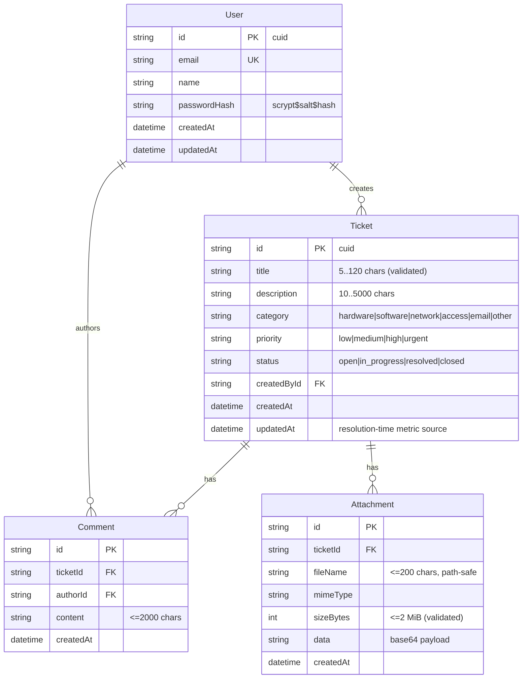

# ServiceDesk — Master Project Architecture Document (PAD) v1.0

**Classification:** Internal Engineering Reference
**Status:** DEFINITIVE, PRODUCTION-LOCKED BLUEPRINT
**Companion Document:** README.md (user-facing), AGENTS.md (agent instructions), CLAUDE.md (contribution standards)
**Last Updated:** 2026-10-09
**Audience:** Senior Engineers, Tech Leads, DevOps, and Onboarding Engineers
**Rule:** Every architectural decision in this document traces to a specific rationale. Nothing is here "because it's popular."

---

## Table of Contents

1. [System Overview & Decisions](#1-system-overview--decisions)
2. [High-Level System Topology](#2-high-level-system-topology)
3. [Application Architecture](#3-application-architecture)
4. [Data Architecture](#4-data-architecture)
5. [Design System Reference](#5-design-system-reference)
6. [Security Architecture](#6-security-architecture)
7. [Testing Strategy](#7-testing-strategy)
8. [Build & Deployment](#8-build--deployment)
9. [Developer Handbook](#9-developer-handbook)
10. [Known Issues & Outstanding Tasks](#10-known-issues--outstanding-tasks)
11. [Key Files Reference](#11-key-files-reference)
12. [Glossary](#12-glossary)

---

## 1. System Overview & Decisions

### 1.1 Document Metadata & Purpose

ServiceDesk is an IT support ticketing portal — a visual-parity, feature-superset clone of the base44 ServiceDesk reference application, rebuilt as a single deployable Next.js process with a SQLite database. This PAD is the definitive engineering reference for onboarding, debugging, and replication: it captures the layer model, the data contract, the security architecture, and the hard-won framework quirks that are not obvious from filenames.

**How to use it:** a new engineer should read §1–§4 before touching code; anyone debugging styling/auth/navigation should read §3.3, §5, and §6 first; operators should read §8–§9.

### 1.2 Technology Stack Summary

| Layer | Technology | Version | Key Rationale |
|---|---|---|---|
| Web framework | Next.js (App Router, `output: standalone`) | 16.4.0 | One-process deployment; server-rendered auth guard; route handlers replace a separate API tier |
| UI runtime | React | 19.3.0 | Required by Next 16; no `forwardRef` needed in new code |
| Language | TypeScript (strict) | 5.9.3 | Type-safe contracts across pages, API, and tests |
| Styling | Tailwind CSS (CSS-first `@theme inline`) | 4.3.3 | Matches the reference's utility-class DOM; v4 removes the config file entirely |
| Components | shadcn/ui on Radix primitives | vendored in `src/components/ui` | The reference app uses the same primitives (`data-sidebar` DOM) — parity at the component level |
| Icons | lucide-react | 0.525.0 | Reference-matched icon set (`lucide-users`, `lucide-circle-alert`, …) |
| ORM | Prisma | 6.19.3 | Schema-as-code + typed client; CLI's schema-relative `file:` URL rule anchors the db-path contract |
| Database | SQLite | — | Zero-config single-file DB; the reference's data model fits comfortably |
| Auth | Custom HMAC cookie sessions + Node scrypt | — | Email/password only; no supply-chain surface; fully unit-tested |
| Unit tests | Vitest | 5.0.3 | Fast node-environment tests for pure seams |
| E2E tests | Playwright (Chromium) | 1.64.0 | Drives the PRODUCTION standalone build, not a dev server |
| Runtime | Bun (dev/seed) / Node ≥ 20 (server) | 1.3.x / ≥20 | Bun runs TS seeds natively; the standalone server is plain Node |

### 1.3 Architecture Decision Records (ADRs)

**ADR-001: Clone the reference with Next.js App Router + route-group auth guard**

- **Context:** The reference is a base44 SPA with client-side routing and JWT-in-localStorage auth. The clone must reproduce its routes (`/dashboard`, `/submitticket`, `/mytickets`, `/ticketdetails?id=`) and its visual DOM while being a maintainable, deployable artifact.
- **Decision:** Next.js 16 App Router. Public routes (`/login`, `/signup`, `/forgotpassword`) are standalone pages; all authenticated pages live in the `src/app/(app)/` route group whose `layout.tsx` resolves the session server-side and redirects unauthenticated visitors to `/login` before any page markup streams.
- **Rationale:** Server-side guarding removes the flash-of-login-page and keeps auth logic in one place. The route group preserves the reference's URL shapes without a path prefix.
- **Consequences:** Pages under `(app)` are client islands (they hydrate onto the server shell) — acceptable because the interactivity (filters, forms, comments) is inherently client-side. The guard lives in exactly one file.
- **Alternatives Rejected:** A `middleware`/`proxy.ts` gate (duplicates the session resolution and complicates the cookie flow for no gain at this scale); pure SPA with client auth (loses SSR guard, weaker parity tooling).

**ADR-002: SQLite via Prisma, one file at `<repo>/db/custom.db`, resolved by a tested seam**

- **Context:** The deployment must be one process with zero external services, and `DATABASE_URL="file:../db/custom.db"` (schema-relative) must point at the same file for the Prisma CLI, `next dev`, `next build`, and the standalone server — which `process.chdir`s into `.next/standalone`.
- **Decision:** `prisma/schema.prisma` + `src/lib/db-path.ts`. Relative `file:` URLs resolve against the first "anchor" directory containing `prisma/schema.prisma` (module repo root → standalone-repo detector → CWD fallback); absolute and non-SQLite URLs pass through. The Prisma client singleton (`src/lib/db.ts`) sets `process.env.DATABASE_URL` via this seam before instantiation.
- **Rationale:** The Prisma CLI anchors relative `file:` URLs against the schema file; the runtime seam replicates that exact rule, so all four processes open ONE database file regardless of working directory.
- **Consequences:** 15 unit tests pin the contract (`tests/db-path.test.ts`). Production deployments may use absolute paths, which pass through untouched. npm scripts additionally pin `DATABASE_URL` inline because an ambient exported variable overrides `.env` files.
- **Alternatives Rejected:** Always-absolute paths (breaks the "clone and run" story); Postgres (violates the zero-service constraint; `skills/rootless-postgresql` exists if the data model outgrows SQLite).

**ADR-003: Hand-rolled HMAC cookie sessions + scrypt instead of an auth library**

- **Context:** The app needs email/password auth only. The reference uses base44's platform JWT-in-localStorage, which is not reproducible and is weaker than httpOnly cookies.
- **Decision:** `src/lib/auth.ts` — sessions are `base64url(JSON payload).HMAC-SHA256(payload)` in an httpOnly, SameSite=Lax cookie (7-day TTL, `Secure` in production, `AUTH_SECRET` signing key); passwords hash with Node `scrypt` (64-byte key, 16-byte per-user salt, constant-time verification). Login/signup/forgot-password are rate-limited per IP (10/15 min, in-memory sliding window).
- **Rationale:** ~150 auditable lines replace a dependency tree; every primitive (sign, verify, tamper, expiry, hashing, rate limit) is unit-tested. httpOnly cookies remove the XSS token-theft class entirely.
- **Consequences:** The rate limiter is per-process (fine for single-server deploys; documented limitation for horizontal scale). Password reset is request-logging only (no mail transport configured) — the API response is enumeration-safe.
- **Alternatives Rejected:** NextAuth/Auth.js (OAuth machinery we do not need); Better Auth (adds a dependency for the same contract); storing tokens in localStorage (XSS-exposed, matches neither our threat model nor production-grade standards).

**ADR-004: Tailwind v4 CSS-first tokens with `@theme inline`, measured-reference styling**

- **Context:** Visual parity with the reference is a hard requirement, and the reference's DOM is utility-class based (shadcn). Tailwind v4 changed the configuration model.
- **Decision:** No `tailwind.config.js`. `src/app/globals.css` declares semantic tokens as `@theme inline { --color-*: var(--*) }` over a literal-hex `:root` palette (light + dark). All reference-measured values (sidebar `#fafafa`, cyan→blue gradients, amber/emerald accents, navy scale) live in that one file.
- **Rationale:** `@theme inline` is the officially supported pattern for referencing `:root` variables; a bare `@theme` with `var()` chains is silently dropped by the v4 build (pinned in `docs/Tailwind-V4-Validation-Report.md` and the scandihaven hard lessons). Utilities then compose the reference's exact classes.
- **Consequences:** Two cascade rules must be respected forever: (1) never regress `inline`; (2) variant utilities (e.g. `data-[active=true]:text-*`) outrank plain utilities — overrides on variant-styled primitives need the `!` modifier (see the `text-white!` comment in `app-sidebar.tsx`).
- **Alternatives Rejected:** Tailwind v3 + config file (fights the toolchain's current default); CSS modules (breaks utility-class parity with the reference DOM).

**ADR-005: Superset features stay additive to the reference surface**

- **Context:** The clone must be a functional superset (production-ready) while preserving visual parity.
- **Decision:** Additions are: working signup, forgot-password request, file attachments (2 MiB × 3, base64 in SQLite, streamed downloads), owner-side status transitions, search/filter/sort/scope on My Tickets, comment threads, average-resolution-time metric, health endpoint, rate limiting, security headers, toasts, skeletons. None of them alter reference-visible structure — they extend existing cards/panels.
- **Rationale:** Every addition lives where the reference has a stub or an obvious gap; the E2E suite pins both the reference contracts (mobile sheet, gradient active nav) and the additions.
- **Consequences:** The "All Tickets" scope toggle and the status dropdown are visible superset affordances — documented here as intentional deviations.
- **Alternatives Rejected:** Admin/agent workflows (scope creep beyond the reference's user-facing portal).

**ADR-006: E2E drives the production standalone build, not the dev server**

- **Context:** Dev-mode behavior differs from production (dev overlay, Turbopack chunking), and the standalone `server.js` has its own working-directory quirks.
- **Decision:** `playwright.config.ts` boots `bun .next/standalone/server.js` on :3100 with an isolated `db/e2e.db` (schema pushed + seeded by the global setup) and one shared authenticated `storageState` produced by a setup project.
- **Rationale:** Tests the exact artifact that ships; the isolated DB keeps runs deterministic; the single sign-in respects the rate limiter budget.
- **Consequences:** `bun run build` must precede `test:e2e`. The standalone-repo detector in `db-path.ts` is exercised for real on every run.
- **Alternatives Rejected:** Testing against `next dev` (misses standalone-specific defects — exactly the class this project's db-path work exists for).

---

## 2. High-Level System Topology

```mermaid
flowchart TB
    subgraph Client
        B[Browser - desktop / mobile]
    end
    subgraph Edge
        PX[Reverse proxy - optional\nforwards X-Forwarded-Proto]
    end
    subgraph App["Single Next.js process (standalone server.js)"]
        RSC[Server Components\n(app) layout guard · root layout]
        PAGES[Client page islands\ndashboard · submitticket · mytickets · ticketdetails\nlogin · signup · forgotpassword]
        API[Route handlers /api/*\nauth · tickets · comments · attachments\nstats · health]
        AUTH[auth.ts\nHMAC sessions · scrypt · rate limit]
        DBP[db-path.ts + db.ts\nURL resolution · Prisma singleton]
    end
    subgraph Data
        SQLite[(SQLite file\ndb/custom.db)]
    end
    B --> PX --> RSC
    RSC --> PAGES
    B -->|fetch JSON| API
    API --> AUTH
    API --> DBP
    RSC --> AUTH
    AUTH --> DBP
    DBP --> SQLite
```

**Runtime characteristics:** one process, ~50 MiB RSS class, SQLite in WAL-less file mode. Scaling is vertical (SQLite handles this workload comfortably to thousands of tickets); the first horizontal-scale milestone requires moving the rate limiter to shared storage and the database to Postgres (`skills/rootless-postgresql` documents the path).

**Key constraints:** the process must start from the repo root (npm scripts guarantee the CWD the db-path and standalone trace rely on); `X-Forwarded-Proto` must reach it behind TLS-terminating proxies so cookie `Secure` attributes derive correctly.

---

## 3. Application Architecture

### 3.1 The Layer Model

```
Layer 0: Pages & chrome — src/app/** (route group guard, client islands, shadcn ui/)
         Rule: no domain logic; every mutation goes through Layer 2; auth checks never appear here.
Layer 1: API route handlers — src/app/api/**
         Rule: validate input (Layer 3), resolve the session (Layer 3), call Prisma,
               return { error, errors? } JSON with a correct status code. Never throw across the boundary.
Layer 2: Data access — src/lib/db.ts (Prisma singleton) + prisma/schema.prisma
         Rule: all queries through the singleton; no direct @prisma/client imports in app code.
Layer 3: Domain seams — src/lib/{auth,validation,constants,utils,db-path}.ts
         Rule: pure (no React, no DB in the pure parts), unit-tested, single source of truth
               for the ticket vocabulary, session crypto, input rules, and the db-path contract.
```

The golden rule: **domain rules live in Layer 3, are consumed identically by Layers 0–2, and are pinned by unit tests** — the UI never re-implements validation, and the API never re-defines the vocabulary.

### 3.2 Annotated Directory Structure

```
service-desk/
├── prisma/
│   ├── schema.prisma            ← User/Ticket/Comment/Attachment; relative file: URL anchors here
│   └── seed.ts                  ← idempotent (upsert-by-email, existence-by-title) demo corpus
├── db/                          ← SQLite file lands here (custom.db gitignored; .gitkeep tracked)
├── src/
│   ├── app/
│   │   ├── (app)/               ← AUTHENTICATED route group
│   │   │   ├── layout.tsx       ← server session guard + ToastProvider + sidebar chrome
│   │   │   ├── dashboard/       ← stat cards, performance metrics, recent tickets, bottom CTA
│   │   │   ├── submitticket/    ← form + emoji category select + attachment upload
│   │   │   ├── mytickets/       ← search + status/priority/sort/scope controls + card list
│   │   │   └── ticketdetails/   ← description, comments, ticket info panel, owner status control
│   │   ├── api/
│   │   │   ├── auth/{login,signup,logout,me,forgot-password}/route.ts
│   │   │   ├── tickets/route.ts                ← GET list (filters) + POST create
│   │   │   ├── tickets/[id]/route.ts           ← GET detail + PATCH owner status
│   │   │   ├── tickets/[id]/comments/route.ts  ← POST comment (tx: comment + touch updatedAt)
│   │   │   ├── tickets/[id]/attachments/[attachmentId]/route.ts ← streamed download
│   │   │   ├── stats/route.ts                  ← mine + global counts + avg resolution
│   │   │   └── health/route.ts                 ← liveness + DB probe
│   │   ├── login/ · signup/ · forgotpassword/  ← standalone auth cards
│   │   ├── layout.tsx           ← Inter font, metadata, globals.css
│   │   ├── page.tsx             ← "/" → /dashboard | /login
│   │   └── globals.css          ← Tailwind v4 tokens (@theme inline) + light/dark palettes
│   ├── components/
│   │   ├── ui/                  ← shadcn primitives: sidebar, sheet, select, dialog-free set,
│   │   │                          button, card, input, label, textarea, badge, avatar, separator,
│   │   │                          skeleton, tooltip, toast(radix)
│   │   ├── app-sidebar.tsx      ← nav (gradient active) + QUICK STATS + user footer + logout
│   │   ├── app-sidebar-chrome.tsx ← SidebarProvider + SidebarInset + mobile header (md:hidden)
│   │   ├── ticket-bits.tsx      ← Status/Priority/Category badges + TicketCard (reference classes)
│   │   └── toast.tsx            ← Radix toast viewport + useToast context
│   ├── hooks/
│   │   └── use-mobile.ts        ← useSyncExternalStore media query (no effect setState)
│   └── lib/
│       ├── auth.ts              ← sign/verify session, scrypt hash/verify, rate limit, getSession
│       ├── constants.ts         ← ticket vocabulary + emoji/label maps + attachment limits
│       ├── validation.ts        ← ticket/comment/signup/login/attachment guards
│       ├── utils.ts             ← cn, formatDateTime ("Oct 9, 2026 at 12:47 AM"), formatDuration
│       ├── db-path.ts           ← the DATABASE_URL resolution contract (pure, tested)
│       ├── db.ts                ← Prisma singleton (resolves URL via db-path first)
│       └── __tests__/           ← auth, domain (constants+validation), utils unit tests
├── tests/
│   ├── db-path.test.ts          ← 15 tests pinning the URL contract
│   └── e2e/                     ← auth, dashboard, tickets, mobile-navigation specs
│                                  + auth.setup.ts (shared session) + global-setup.ts (e2e.db)
├── scripts/
│   ├── smoke-test.sh            ← API surface on a throwaway standalone server
│   ├── probe-gradients.mjs      ← Playwright probe: sidebar gradients via UI login
│   └── gradient-test{,2}.mjs    ← isolated oklab/lab() gradient rendering experiments
├── docs/
│   ├── DEPLOYMENT.md            ← production build/run/env contract
│   ├── Tailwind-V4-Validation-Report.md ← the v3→v4 facts behind ADR-004
│   ├── how-to-git-push-using-ssh-wrapper_SKILL.md + ssh_git_wrapper_v3.py
│   ├── screenshots/             ← 7 dev-server captures (desktop ×5, mobile ×2)
│   └── …                        ← prompts, skills inventory (repo scaffolding provenance)
├── skills/                      ← the in-repo skill catalog used to build this clone
├── next.config.ts               ← standalone + tracing root + devIndicators:false + headers
├── vitest.config.ts · playwright.config.ts · eslint.config.mjs · tsconfig.json
└── package.json                 ← scripts pin DATABASE_URL inline (see ADR-002)
```

### 3.3 Critical Code Patterns

**Pattern 1 — The session guard (server) + client islands**

```tsx
// src/app/(app)/layout.tsx — the ONLY auth check in the chrome
export default async function AppGroupLayout({ children }) {
  const user = await getCurrentUser();      // lib/auth.ts → cookies() (async in Next 16)
  if (!user) redirect("/login");            // streams before any page markup
  return (
    <ToastProvider>
      <AppSidebarChrome user={user}>{children}</AppSidebarChrome>
    </ToastProvider>
  );
}
```

*Why this pattern:* one guard, zero duplicated checks, no flash of unauthenticated content. Pages stay `"use client"` islands that hydrate onto the shell — the reference app's exact interactive behavior with server-side safety.

**Pattern 2 — Validated-string enums as the single vocabulary**

```ts
// src/lib/constants.ts (excerpt) — SQLite has no enums; this is the contract
export const TICKET_STATUSES = ["open", "in_progress", "resolved", "closed"] as const;
export type TicketStatus = (typeof TICKET_STATUSES)[number];
export function isTicketStatus(v: unknown): v is TicketStatus { /* … */ }
```

*Why this pattern:* the API, the UI badges (`STATUS_BADGE_CLASSES`), the filters, and the E2E assertions all import the same arrays — adding a status is a one-file change plus tests, with compile-time safety everywhere else.

**Pattern 3 — The Tailwind v4 variant-cascade override (load-bearing `!`)**

```tsx
// src/components/app-sidebar.tsx — active nav item
isActive
  ? "bg-gradient-to-r from-cyan-500 to-blue-600 text-white! shadow-lg shadow-cyan-500/30"
  : "text-slate-600 hover:bg-gradient-to-r hover:from-cyan-50 hover:to-blue-50 hover:text-cyan-700"
```

*Why this pattern:* the shadcn `SidebarMenuButton` base carries `data-[active=true]:text-sidebar-accent-foreground`; Tailwind v4 orders variant utilities after plain ones, so a plain `text-white` silently loses. The `!` modifier is pinned by an E2E computed-style assertion (`mobile-navigation.spec.ts`), and the comment explains the why for the next maintainer.

**Pattern 4 — Cancellable client fetches on route change**

```tsx
// src/components/app-sidebar.tsx — QUICK STATS refresh (excerpt)
React.useEffect(() => {
  let cancelled = false;
  fetch("/api/stats").then((r) => (r.ok ? r.json() : null)).then((data) => {
    if (!cancelled && data?.global) setStats(/* … */);
  }).catch(() => { /* non-critical; skeleton stays */ });
  return () => { cancelled = true; };
}, [pathname]);
```

*Why this pattern:* stats stay live per navigation without a server-state library; the cancel flag prevents a stale response from a previous route overwriting the current one; failures degrade to the skeleton rather than an error boundary.

**Pattern 5 — Mobile off-canvas sheet with auto-close on navigate**

```tsx
<Link href={item.href} onClick={() => setOpenMobile(false)}> … </Link>
```

*Why this pattern:* the shadcn Sidebar renders as a Radix Sheet on mobile but does not close itself on navigation — without this line the overlay traps the user after every nav tap. The behavior is pinned by the E2E spec ("tapping a nav link navigates AND auto-closes the sheet").

---

## 4. Data Architecture

### 4.1 Database Schema



Indexes: `Ticket(createdById, createdAt DESC)` (My Tickets + Recent Tickets), `Ticket(status)` (global quick stats), `Comment(ticketId, createdAt)` (thread order), `Attachment(ticketId)`.

### 4.2 Persistence Strategy

- **One file, four processes:** the Prisma CLI, `next dev`, `next build`, and the standalone server all open `<repo>/db/custom.db` through the `db-path.ts` anchor rule (ADR-002). Migrations are `prisma db push` for this scale; the schema is forward-only in practice (additive columns first, backfill, then drop).
- **Seeding is idempotent:** users upsert by email (never overwriting an existing password hash); tickets skip on title match. The E2E global setup reuses it against `db/e2e.db`.
- **Attachments in SQLite:** base64 columns capped at 2 MiB × 3 per ticket keep the deployment single-file; the download route streams bytes with a sanitized `Content-Disposition`. If attachment volume grows, the documented upgrade is object storage + a URL column.

---

## 5. Design System Reference

### 5.1 Typographic System

- **Typeface:** Inter (`next/font/google`, CSS variable `--font-sans`) — the reference renders a system-Inter stack.
- **Scale:** page titles `text-3xl font-bold tracking-tight`; card titles `text-lg font-semibold`; stat values `text-4xl font-bold tabular-nums`; body `text-sm text-slate-600`; micro-labels `text-xs uppercase tracking-wider text-slate-500` (sidebar group labels).

### 5.2 Color Tokens

| Token | Light | Usage |
|---|---|---|
| `--background` | `#f8fafc` | Page base; page areas layer the reference gradient `from-slate-50 via-white to-blue-50/30` |
| `--sidebar` | `#fafafa` | Sidebar panel — measured, NOT white |
| `--primary` / `--ring` | `#0891b2` / `#06b6d4` | Primary actions, focus rings |
| `--navy-950/900/800` | `#0a1628/#0f2744/#1a3a5c` | Login logo badge, dark theme surfaces |
| `--amber-500` | `#f59e0b` | "Open" quick-stat badge |
| `--emerald-500` | `#10b981` | Resolved accents, success toasts |

Badge pairs (status): open `bg-amber-100 text-amber-800 border-amber-300`; in_progress `bg-blue-100 text-blue-700`; resolved `bg-emerald-100 text-emerald-800`; closed `bg-slate-100 text-slate-600`. Priority: low slate, medium blue, high orange, urgent red. All measured from the reference DOM.

### 5.3 Component Primitives

shadcn/ui (New York flavor) vendored in `src/components/ui/` — **sidebar** (with its Sheet-based mobile representation and `useSidebar` context) is the keystone: it reproduces the reference's `data-sidebar` attribute DOM, which is what the E2E specs assert against. Select, Tooltip, and Toast are Radix-portal components; their content renders in portals (assert accordingly in tests).

### 5.4 Motion / Animation

- Cards/links: `transition-all duration-300` + hover lift (`hover:shadow-xl`), icon-tile scale on group hover (`group-hover:scale-110`), ticket-card arrow slide (`group-hover:translate-x-1`).
- Entrance animation (session 3, measured from the reference's framer-motion): `animate-rise-in` — `opacity 0→1` + `translateY(20px)→0`, 0.3 s `cubic-bezier(0.34, 1.56, 0.64, 1)` (≈ a ~310 ms spring with ~12% overshoot, no stagger) on dashboard stat cards + recent rows, mytickets cards, the submit form card, and the detail back+grid wrapper.
- Mobile sheet: `slide-in-from-left` 500 ms open / 300 ms close (E2E waits 700 ms before geometry assertions).
- Decorative stat-card circles: `opacity-10` corner gradient scaling to 150% over 500 ms on hover.
- `prefers-reduced-motion` is honored globally (globals.css) and on the rise-in entrance utility — see §10 (resolved session 3).

---

## 6. Security Architecture

### 6.1 Security Rules

| Rule | Enforcement |
|---|---|
| Sessions are unforgeable | HMAC-SHA256 over the payload; `timingSafeEqual` verification (unit-tested tamper/expiry cases) |
| Passwords are never reversible | scrypt + per-user salt; constant-time compare; hash format verified on read |
| Cookies are unreachable from JS | `httpOnly` + `SameSite=Lax` + `Secure` in production (`sessionCookieOptions()`) |
| Auth endpoints resist brute force | Per-IP sliding-window rate limit (10/15 min) with `Retry-After` on 429 |
| Every authenticated route checks the session | `(app)` layout guard (server) + per-request `getCurrentUser()` in every handler |
| Ticket mutations are owner-scoped | PATCH refuses non-owners with 403; list scope defaults to `mine` |
| No account enumeration | forgot-password returns an identical generic message; login errors are identical for unknown email and wrong password |
| Input is validated before use | `src/lib/validation.ts` guards (lengths, vocabulary, email shape, attachment size/count/filename) on every mutating handler |
| Attachments cannot escape the download route | Filename sanitized (`[^\w.\- ]` → `_`) for `Content-Disposition`; size capped at upload |
| SQL injection is structurally impossible | All queries via Prisma; no string-built SQL exists |
| Clickjacking/mimetype sniffing blocked | `X-Frame-Options: DENY`, `X-Content-Type-Options: nosniff`, `Referrer-Policy`, `Permissions-Policy` (next.config.ts headers) |
| Secrets never enter the tree | `.env` gitignored; ssh wrapper shreds key material; pre-commit habit documented in CLAUDE.md |

### 6.2 Security Utilities Inventory

`src/lib/auth.ts` (sessions, hashing, rate limiting, client IP extraction), `src/lib/validation.ts` (all input guards), `src/app/api/tickets/[id]/attachments/[attachmentId]/route.ts` (download sanitization), `next.config.ts` (security headers), `docs/ssh_git_wrapper_v3.py` (secret-free push flow).

### 6.3 Authentication & Authorization

Single role today: **authenticated user**. Ownership is the authorization unit — a user reads any ticket (mirroring the reference's shareable detail URLs) but may only transition tickets they created. There is no admin role by design (ADR-005); introducing agents/admins would add an `isAgent` flag plus a guarded transition path, not a new auth system.

### 6.4 Threat Model (key vectors)

| Vector | Mitigation |
|---|---|
| Session forgery/tampering | HMAC + constant-time verify (unit-pinned) |
| XSS stealing tokens | No tokens in JS-reachable storage (httpOnly cookies); React auto-escaping; no `dangerouslySetInnerHTML` |
| Brute-force login/signup/reset | Shared per-IP rate limiter; E2E budgeted to stay under it |
| Ownership bypass via API | Server-side `createdById` comparison on every mutation |
| Malicious uploads | Size/count caps, MIME recorded but content streamed with `Content-Disposition: attachment` (never inline), path-safe filenames |
| Open redirect / CSRF surface | No redirect params exist; SameSite=Lax cookies; mutations are JSON POSTs (not form-encodable cross-site) |
| Secret leakage via repo | `.env` ignored; wrapper-managed keys; documented pre-commit scan habit |

---

## 7. Testing Strategy

### 7.1 Test Distribution

| Category | Files | Tests | Location | Framework |
|---|---|---|---|---|
| Unit — auth (session/crypto/rate-limit) | 1 | 11 | `src/lib/__tests__/auth.test.ts` | Vitest |
| Unit — domain (constants + validation) | 1 | 18 | `src/lib/__tests__/domain.test.ts` | Vitest |
| Unit — utils (date/duration formatting incl. `formatDate`) | 1 | 9 | `src/lib/__tests__/utils.test.ts` | Vitest |
| Unit — db-path URL contract | 1 | 15 | `tests/db-path.test.ts` | Vitest |
| E2E — auth surface (logged-out) | 1 | 6 | `tests/e2e/auth.spec.ts` | Playwright |
| E2E — dashboard (incl. clean-hydration pin) | 1 | 8 | `tests/e2e/dashboard.spec.ts` | Playwright |
| E2E — ticket lifecycle | 1 | 5 | `tests/e2e/tickets.spec.ts` | Playwright |
| E2E — mobile + desktop navigation | 1 | 9 | `tests/e2e/mobile-navigation.spec.ts` | Playwright |
| E2E — visual parity (session-2 + session-3 contracts) | 1 | 29 | `tests/e2e/visual-parity.spec.ts` | Playwright |
| E2E — shared session setup project | 1 | 1 | `tests/e2e/auth.setup.ts` | Playwright |
| API smoke | 1 | 11 steps | `scripts/smoke-test.sh` | bash + curl |

> Session-2 additions: the first 18 visual-parity tests pin the reference-measured design contracts (gradient quick stats, flat recent rows, detail grid + gradient header, `text-4xl` headings, non-sticky mobile header, login shell). The two tickets.spec locator defects (non-retrying `count()`; toast-announcer strict-mode ambiguity) were fixed with `toHaveCount` and `{ exact: true }` respectively — the patterns are documented in AGENTS.md.
>
> Session-3 additions: 11 more parity tests (recent-row FileText tile + arrow + date-only dates, lowercase badges, entrance animations incl. `prefers-reduced-motion`, submit-form details, login caption removal, search icon size, info-panel tracking, main-element classes), the clean-hydration pin in dashboard.spec (a `<div>`-in-`<p>` Skeleton broke hydration — fixed with an inline span skeleton), and `formatDate` unit tests. Raw `evaluate(getComputedStyle)` assertions were hardened to auto-retrying `toHaveCSS` after a one-off full-suite flake.

### 7.2 Test Patterns

- **Computed-style assertions as ground truth** (the clone-app-pat-pro discipline): the desktop nav spec asserts `backgroundImage` contains `linear-gradient` and `color === "rgb(255,255,255)"` — CSS-level parity that screenshots cannot pin reliably.
- **Shared authenticated session:** the Playwright setup project signs in once; `storageState` replays the cookie into every spec (rate-limiter budget).
- **Geometry assertions wait out animations** (700 ms after sheet open) — the round-3 lesson from the scaffold's history.
- **Isolated E2E database:** `db/e2e.db` is schema-pushed and seeded by `global-setup.ts`; specs use unique titles (`E2E ticket ${Date.now()}`) so runs are re-runnable.

### 7.3 Coverage Thresholds

No numeric coverage gate is configured (documented honestly). The implicit contract: every pure seam in `src/lib/` is unit-tested; every UI contract that parity depends on (sidebar chrome, quick stats, sheet behavior, gradient active state, ticket lifecycle) is E2E-pinned. New domain logic requires a failing test first (CLAUDE.md workflow).

### 7.4 Pre-PR / Pre-Deploy Checklist

- [ ] `bun run lint` — zero warnings
- [ ] `bun run typecheck` — clean
- [ ] `bun run test` — 50/50
- [ ] `bun run build` — standalone assembles
- [ ] `bun run test:e2e` — 28/28 (after build; UI/auth changes)
- [ ] `bash scripts/smoke-test.sh` — all PASS (API changes)
- [ ] Screenshot diff vs `docs/screenshots/` for visual changes
- [ ] `git ls-files | grep -E '^\.env$|\.key$|ssh-key'` — empty (before doc-heavy commits)

---

## 8. Build & Deployment

### 8.1 Production Build

```bash
bun install
bun run build   # next build + copy .next/static & public into .next/standalone
```

Output: `.next/standalone/server.js` (Node), `.next/standalone/.next/static`, `.next/standalone/public`, `.next/standalone/prisma/schema.prisma` (file-traced — the db-path anchor inside standalone).

### 8.2 Environment Variables

| Name | Required | Description | Default |
|---|---|---|---|
| `DATABASE_URL` | yes | SQLite URL; relative anchors against `prisma/schema.prisma` (`file:../db/custom.db` → `<repo>/db/custom.db`). Production: use an absolute path. | `file:../db/custom.db` (via `.env`) |
| `AUTH_SECRET` | production | HMAC session key — `openssl rand -hex 32` | insecure dev constant + loud warning |
| `PORT` | no | Server port | `3000` |
| `NEXT_PUBLIC_SITE_URL` | no | Canonical origin for metadata | `http://localhost:3000` |

### 8.3 Docker Configuration

None by design (single Node process; `docs/DEPLOYMENT.md` documents the bare-metal/systemd path). A Dockerfile would be `FROM node:20-slim` + the standalone folder + an absolute `DATABASE_URL` volume — deferred until a container target exists.

### 8.4 CI/CD Pipeline

CI runs on GitHub Actions (`.github/workflows/ci.yml`, added session 3): a `verify` job (lint → typecheck → unit → build, the same gate as §7.4) plus an `e2e` job restoring the standalone build and running the Playwright suite. Pushes go to `git@github.com:nordeim/service-desk.git` main-only via `docs/ssh_git_wrapper_v3.py` (key materialized to a 0600 temp file, shredded after; remote ref re-verified against local HEAD).

---

## 9. Developer Handbook

### 9.1 Local Setup

```bash
bun install
cp .env.example .env                  # set AUTH_SECRET for production parity
bun run db:push && bun run db:seed
bun run dev                           # demo@servicedesk.app / Demo1234!
```

### 9.2 Common Commands

| Command | Location | Purpose |
|---|---|---|
| `bun run dev` | repo root | Dev server :3000 (logs → `dev.log`) |
| `bun run db:seed` | repo root | Idempotent seed |
| `bun run test:e2e` | repo root | Full E2E (build first) |
| `bash scripts/smoke-test.sh` | scripts/ | API contract check |
| `bun scripts/probe-gradients.mjs` | scripts/ | Reproduce gradient/screenshot questions |
| `python3 docs/ssh_git_wrapper_v3.py --key-file <key> --remote git@github.com:nordeim/service-desk.git` | repo root | Verified push (see the ssh SKILL doc) |

### 9.3 Code Style Rules

Enforced: ESLint 9 flat (`eslint-config-next` + the `react-hooks/set-state-in-effect` error), `tsc --noEmit` strict, Vitest explicit imports. Conventional (not lint-enforced): PascalCase components, camelCase utils, `@/` alias imports, comments explain why.

### 9.4 Git Workflow

Main-only trunk with atomic Conventional Commits. Feature branches are short-lived when used. The push flow is the SSH wrapper (AGENTS.md "Reference" links the runbook); never commit `.env`, keys, or `db/*.db`.

---

## 10. Known Issues & Outstanding Tasks

| Priority | Issue | Impact | Status |
|---|---|---|---|
| ~~MEDIUM~~ | ~~No hosted CI~~ | A regression can land if a contributor skips the gate | **Resolved (session 3)** — `.github/workflows/ci.yml`: verify job (lint → typecheck → unit → build) + e2e job (Playwright against the restored standalone build) on push/PR to main |
| MEDIUM | Rate limiter is per-process (in-memory) | Horizontal scaling would share no state | Open by design (ADR-003); document before scaling out |
| LOW | Forgot-password logs the request but sends no mail | UX gap vs. a full reset flow (enumeration-safe response implemented) | Open (wire Resend/SendGrid when a domain exists) |
| ~~LOW~~ | ~~No `prefers-reduced-motion` handling~~ | Motion-sensitive users see full animations | **Resolved (session 3)** — global reduced-motion block in `globals.css` + `motion-reduce:animate-none` on the `animate-rise-in` utility (E2E-pinned) |
| LOW | No numeric coverage threshold | Coverage discipline is convention, not gate | Open (`vitest --coverage` + thresholds when the suite grows) |
| INFO | Attachment storage is base64-in-SQLite | 2 MiB × 3 cap keeps it safe; volume growth → object storage | Documented (§4.2) |
| INFO | Dev-mode Next overlay (bottom-left dark circle) overlaps the sidebar footer in dev screenshots | Visual-check false positive only; production never renders it | Mitigated (`devIndicators: false` + AGENTS.md note) |
| RESOLVED | Visual parity gaps vs the live reference (25 findings, session 2: flat quick stats, card-style recent list, flex detail layout, old login shell, `text-3xl` headings, sticky mobile header) | Parity risk on every page | Fixed — every contract E2E-pinned by `visual-parity.spec.ts`; inventory in `docs/remediation-plan-session2.md` |
| RESOLVED | tickets.spec flakiness (2 locator defects: non-retrying `count()` racing async search; `getByText` strict-mode ambiguity vs the Radix toast announcer) | 2 tests failing intermittently in full runs | Fixed with `toHaveCount` + `{ exact: true }` (session 2) |
| RESOLVED | Session-3 parity gaps (12 findings: emoji tile + no arrow + category badge + datetime on dashboard recent rows; capitalized badges; missing entrance animations; submit-form details; login caption; search icon size; info-panel tracking; opaque `<main>`) + a hydration error (`<div>`-in-`<p>` Skeleton) | Parity risk on every page + a console error on every dashboard load | Fixed — all E2E-pinned; inventory in `docs/remediation-plan-session3.md` |

---

## 11. Key Files Reference

| File | Lines | Purpose |
|---|---|---|
| `src/lib/auth.ts` | ~170 | Sessions (HMAC), scrypt hashing, rate limiting — the security core |
| `src/lib/db-path.ts` | ~107 | The DATABASE_URL anchor contract (pure, 15-test-pinned) |
| `src/lib/constants.ts` | ~95 | Ticket vocabulary, emoji/label maps, attachment limits |
| `src/lib/validation.ts` | ~120 | Every input guard (ticket/comment/signup/login/attachments) |
| `src/components/ui/sidebar.tsx` | ~700 | shadcn Sidebar (desktop inline + mobile Sheet) — the reference-parity keystone |
| `src/components/app-sidebar.tsx` | ~200 | Nav + gradient quick stats + user footer (the `text-white!` cascade fix lives here) |
| `src/components/app-sidebar-chrome.tsx` | ~50 | Provider tree + gradient wrapper + non-sticky mobile header + `flex-1 overflow-auto` scroll container |
| `src/components/ticket-bits.tsx` | ~140 | Reference-class badges + ticket card (mytickets) + flat recent-ticket row (dashboard) |
| `src/app/(app)/layout.tsx` | ~22 | The auth guard + chrome composition |
| `src/app/(app)/dashboard/page.tsx` | ~230 | Stat cards, performance metrics, recent tickets (reference layout) |
| `src/app/api/tickets/route.ts` | ~120 | List (filters/sort/scope) + create (attachments) |
| `src/app/globals.css` | ~130 | Tailwind v4 tokens (`@theme inline`) + light/dark palettes |
| `prisma/schema.prisma` | ~75 | Data model + the URL anchor |
| `prisma/seed.ts` | ~180 | Idempotent demo corpus |
| `tests/e2e/mobile-navigation.spec.ts` | ~135 | The highest-regression-risk chrome contract |
| `playwright.config.ts` | ~55 | Standalone-server E2E topology (ADR-006) |
| `next.config.ts` | ~40 | Standalone + tracing root + devIndicators + security headers |

---

## 12. Glossary

- **Anchor (db-path):** a candidate repo root that owns `prisma/schema.prisma`; the first matching anchor resolves relative `file:` URLs.
- **Quick stats:** the sidebar's global ticket counters (Open / In Progress / Total) — distinct from the dashboard's per-user stat cards.
- **Scope:** My Tickets (`mine`, default — the signed-in user's tickets) vs. All Tickets (`all` — the global feed; a superset affordance).
- **Vocabulary:** the closed sets of category/priority/status values in `src/lib/constants.ts`.
- **Variant utility:** a Tailwind utility with a variant prefix (e.g. `data-[active=true]:text-*`); in v4 these cascade after plain utilities — the root cause behind the `text-white!` pattern.
- **Reference app:** the base44 ServiceDesk deployment this project clones; "parity" always means parity with it.
