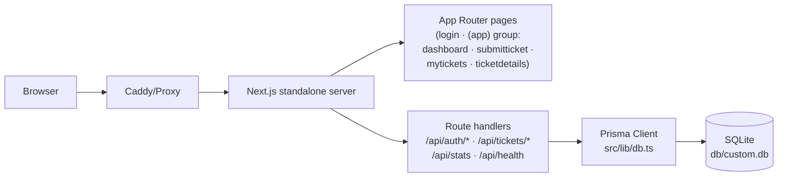

# ServiceDesk — IT Support Portal


A production-ready IT support ticketing portal — a feature-parity **superset** clone of the [base44 ServiceDesk reference app](https://service-desk-332a5ae4.base44.app/), rebuilt on Next.js 16 + React 19 + Prisma/SQLite. Users sign in, submit tickets across six issue categories, track status/priority, converse in comment threads, and manage their own ticket lifecycle.

## Overview

The portal solves a everyday enterprise problem: employees need a single place to report IT issues (hardware, software, network, access, email) and follow them to resolution, while the sidebar keeps live global stats visible. The clone reproduces the reference app's visual design (measured from its live DOM and computed styles — not guessed) and extends it with a working signup flow, password-reset request, file attachments, owner-side status control, search/filter/sort, and a full test pyramid.

**Verification status:** `lint` ✓ · `typecheck` ✓ · 55 Vitest unit tests ✓ · production build ✓ · 176 Playwright E2E tests ✓ · API smoke script ✓ · CI (GitHub Actions, on push/PR to main) ✓

## Key Features

| Feature | Description |
|---|---|
| 🎫 **Ticket lifecycle** | Submit → open → in progress → resolved → closed, with owner-side status control |
| 🔐 **Cookie sessions** | HMAC-SHA256 signed sessions, scrypt password hashing, per-IP rate limiting; the login card swaps in place to the reference's reset-password + signup views (session 10) |
| 🗂️ **Six categories** | Hardware / Software / Network / Access / Email / Other, each with an emoji tile |
| ⚡ **Four priorities** | Low / Medium / High / Urgent, sortable and filterable |
| 💬 **Comments** | Threaded updates per ticket with author + timestamp |
| 📎 **Attachments** | Images/PDFs/Word docs up to 2 MB each, 3 per ticket, streamed downloads — the submit-form rows and the detail-page display render the reference's measured contracts (session 13: the reference DOES ship a full attach UI — `multiple` picker, neutral slate rows, the X icon remove button, the generic "Attachment N" labels, new-tab downloads) |
| 🔍 **Search & filters** | Full-text search, status/priority filters, newest/oldest/priority sort, My/All scope |
| 🛟 **Failure-resilient pages** | Fetch failures surface an error panel with retry (never a silent skeleton/empty state); per-route tab titles + favicon |
| 🧾 **Social/PWA metadata + SEO** | Per-route canonical URLs, OpenGraph + Twitter cards, apple-web-app meta, `theme-color`, a real PWA `manifest.json` (installable, with size-correct 192/512 icons + a 180×180 apple-touch-icon), BreadcrumbList JSON-LD per route (the reference's builder contract — dashboard exempt); `sitemap.xml` (public routes) + `robots.txt` with the Sitemap directive (sessions 10–11) |
| 📊 **Live stats** | Sidebar quick stats (global) + dashboard cards (yours) + average resolution time |
| 📱 **Responsive chrome** | shadcn/ui off-canvas mobile sidebar with overlay, Escape, and auto-close on navigate |
| 🎨 **Parity-pinned design** | 147 E2E parity tests pin the reference's measured contracts (adjacent nav icon/label layout, gradient quick stats, flat recent rows with FileText tiles, detail grid, login card, lowercase badges, entrance animations, badge shadow + per-surface padding, the measured focus-state matrix, reference-computed icon-button padding/shadows/spacings, the system font stack, the v3 radius scale, select dropdown structure + priority colors, the accent-token pair, the auth-error alert contract, the 80% sheet overlay, the button-cursor preflight, the stock shadcn token block, the old-gen Badge base, the translucent sidebar edge, the in-card auth views, the ticket-not-found Alert, the id-less detail route, the PWA manifest/theme-color/apple-icon, the per-route JSON-LD breadcrumbs, the per-route social URL set, the login-view computed margins, the submit-form attachment rows + detail-page attachment display + the no-comments empty state) |
| 🏃 **Entrance animations** | Reference-measured rise-in (opacity + 20px slide, spring easing) on cards/rows — disabled under `prefers-reduced-motion` |
| 🧪 **Test pyramid** | 55 unit + 176 E2E tests + API smoke + GitHub Actions CI, pinned to the UI contract |

## Architecture

| Layer | Technology | Version | Purpose |
|---|---|---|---|
| Framework | Next.js (App Router, standalone output) | 16.4.0 | Server rendering, route handlers, route-group auth guard |
| UI runtime | React | 19.3.0 | Client islands inside server-rendered chrome |
| Language | TypeScript (strict) | 5.9.3 | Type safety across app and tests |
| Styling | Tailwind CSS (CSS-first `@theme inline`) | 4.3.3 | Utility styling; semantic tokens resolve `:root` vars |
| Components | shadcn/ui on Radix primitives | — | Sidebar/Sheet/Select/Tooltip/Toast/etc. |
| ORM | Prisma + SQLite | 6.19.3 | `User` / `Ticket` / `Comment` / `Attachment` at `db/custom.db` |
| Auth | Custom HMAC cookie + scrypt | — | Zero third-party auth surface; auditable in `src/lib/auth.ts` |
| Unit tests | Vitest | 5.0.3 | Pure domain seams: auth, validation, db-path, utils |
| E2E tests | Playwright (Chromium) | 1.64.0 | Production standalone server + isolated `db/e2e.db` |



## File Hierarchy

```
📂 service-desk/
├── 📂 src/
│   ├── 📂 app/
│   │   ├── 📂 (app)/                  ← authenticated route group (layout guards session)
│   │   │   ├── 📂 dashboard/          ← stat cards, performance metrics, recent tickets (flat rows)
│   │   │   ├── 📂 submitticket/       ← ticket form + attachments
│   │   │   ├── 📂 mytickets/          ← search/filter/sort/scope list (max-w-7xl, 3-col filter grid)
│   │   │   └── 📂 ticketdetails/      ← 3-col grid: gradient-header card + comments + info panel
│   │   ├── 📂 api/                    ← route handlers (auth, tickets, comments, stats, health)
│   │   ├── 📂 login/ · signup/ · forgotpassword/
│   │   ├── layout.tsx · page.tsx · globals.css
│   ├── 📂 components/
│   │   ├── 📂 ui/                     ← shadcn primitives (sidebar, sheet, select, toast, …)
│   │   ├── app-sidebar.tsx            ← nav + gradient quick stats + user footer
│   │   ├── app-sidebar-chrome.tsx     ← provider tree + gradient wrapper + mobile header + scroll container
│   │   ├── ticket-bits.tsx            ← badges + ticket card + flat recent-ticket row
│   │   └── toast.tsx                  ← Radix toast + useToast context
│   ├── 📂 hooks/use-mobile.ts         ← useSyncExternalStore media query
│   └── 📂 lib/                        ← auth, db, db-path, validation, constants, utils (+ tests)
├── 📂 prisma/schema.prisma · seed.ts
├── 📂 db/                             ← SQLite file lives here (gitignored *.db)
├── 📂 tests/e2e/                      ← Playwright specs (incl. visual-parity.spec.ts) + setup + global setup
├── 📂 scripts/                        ← smoke-test.sh + gradient probes
├── 📂 docs/                           ← deployment, Tailwind v4 report, remediation plan, screenshots, ssh push skill
├── 📂 public/                         ← logo.png (reference app logo) + robots.txt
└── next.config.ts · vitest.config.ts · playwright.config.ts
```

## Quick Start

Requires **Node.js ≥ 20** (or Bun ≥ 1.1) and Python ≥ 3.9 for the seed's crypto imports.

```bash
git clone https://github.com/nordeim/service-desk.git
cd service-desk
bun install                # or: npm install

cp .env.example .env       # defaults: DATABASE_URL="file:../db/custom.db"
# generate a session secret (REQUIRED in production):
#   python3 -c "import secrets; print(secrets.token_hex(32))"   → AUTH_SECRET

bun run db:push            # create db/custom.db from prisma/schema.prisma
bun run db:seed            # demo corpus: 4 users, 11 tickets, 3 comments

bun run dev                # http://localhost:3000
```

**Demo login:** `demo@servicedesk.app` / `Demo1234!`

### Verify Setup

```bash
curl http://localhost:3000/api/health
# {"status":"ok","db":"up","time":"..."}          ← server + database healthy

bun run lint && bun run typecheck && bun run test
# ESLint clean · tsc clean · 4 files / 55 tests passed
```

## Environment Variables

| Variable | Required | Purpose |
|---|---|---|
| `DATABASE_URL` | yes | SQLite path, **relative to `prisma/schema.prisma`**. Keep `file:../db/custom.db` → resolves to `<repo>/db/custom.db` for CLI, dev, build, and the standalone server (see `src/lib/db-path.ts`). Production recommends an absolute path. |
| `AUTH_SECRET` | prod | HMAC signing key for session cookies (`openssl rand -hex 32`). Falls back to an insecure dev constant with a loud warning. |
| `NEXT_PUBLIC_SITE_URL` | no | Canonical origin for metadata (default `http://localhost:3000`). |

> **Gotcha:** the npm scripts pin `DATABASE_URL='file:../db/custom.db'` inline. An ambient `DATABASE_URL` env var (e.g. from a sandbox) would otherwise override `.env` and redirect the database; the inline pin makes every script deterministic.

## Testing

```bash
bun run test               # Vitest unit: 55 tests (auth HMAC/scrypt/rate-limit, validation, db-path, utils, priority-select colors, attachment accept list)
bun run test:e2e           # Playwright E2E (176 tests): builds nothing — boots the PRODUCTION standalone server
                           # on :3100 with an isolated db/e2e.db (schema pushed + seeded by global setup)
bash scripts/smoke-test.sh # API surface against a throwaway standalone server on :3999
```

E2E notes: the suite signs the demo user in **once** (setup project → saved `storageState`) because the auth endpoints are rate-limited (10 attempts/IP/15 min). `tests/e2e/auth.spec.ts` opts out of the shared session to test the logged-out surface. The mobile-navigation spec pins the off-canvas sheet contract (open, overlay close, Escape close, auto-close on navigate, desktop gradient parity, the 80% overlay dim). `tests/e2e/visual-parity.spec.ts` (147 tests) pins the session-2 through session-13 remediation contracts measured from the live reference: gradient quick-stats rows, flat divide-y recent tickets with FileText icon tiles + arrows + date-only dates, lowercase badges, the detail page's `lg:grid-cols-3` layout with gradient card header, `text-4xl` page headings, the non-sticky mobile header, the login card shell, the reference entrance animation (`animate-rise-in`, disabled under `prefers-reduced-motion`), and the submit form details (circle-alert header icon, blue priority value, upload dropzone, inline footer). Session-5 additions pin the reference-computed values that class names alone cannot express: icon-button 16px horizontal padding, the light v3-name shadow step (`shadow-xs` on the v4 scale), `mr-2` icon spacings, the CTA arrow's `translate-x-1` slide, and the system font stack (the reference loads no webfont). Session-6 additions pin the radius scale (6/8/12px steps — the shadcn v4 calc chain rendered +2px on every rounded control), the focus-state matrix (1px near-black rings on buttons/inputs, 2px slate-400 + white offset on auth inputs, per-surface cyan customs), the select dropdown contracts (emoji-span category options, per-priority option colors, trigger color follows selection), the whole-line signup link, and the shadow-less Google button. Session-7 additions pin the accent-token pair (gray #f5f5f5 + near-black #171717 on option highlights and hover text — ours were cyan), the option-radius drift (reference rounded-sm now 4px), the empty-state markup (w-20 gradient circle, FileText tile, text-xl heading), fetch-failure resilience (error panel + Try again, with recovery), the favicon, and per-route document titles. Session-8 additions pin the auth-error alert contract (translucent red-50/70 + red-700 + rounded-xl + p-4 — the reference's shadcn Alert), the mobile sheet overlay at 80% black, zero horizontal overflow at 375px (a deliberate superset over a defect the reference shares) with ellipsis-active row titles, the social/PWA head set (description, og:*, twitter:card, canonicals, apple-web-app), and the focus-visible ring tails on the raw sign-out/Remove buttons. Session-9 additions pin the Tailwind v4 cursor-preflight restoration (every true button renders the hand cursor, like the reference's v3 build), the stock shadcn token block (near-black --primary driving the dark badge hovers, neutral-200 --border on every Card, near-black --foreground on the CategoryBadge, blue-500 --sidebar-ring on nav keyboard focus — live-measured via real Tab presses), the old-gen Badge base (transition-colors including background-color — the 150 ms hover fade — plus the focus:ring-2 tail, replacing the new-gen ring-[3px] base), and the translucent desktop sidebar edge (border-slate-200/60). Session-10 additions pin the login card's in-card view state machine (the reference's "Forgot password?" / "Need an account? Sign up" buttons swap the card in place — reset view with the shorter h-10/sm:h-11 input generation, the Check-your-email success view with the slate icon circle + green alert, and the three-field signup view), the ticket-not-found state (the reference's destructive shadcn Alert — red-500 text, 50%-alpha border, 8px radius, inline in the max-w-5xl container), the attachment picker's doc/docx families, and the SEO surface (sitemap.xml public-route set + robots.txt with the Sitemap directive). Session-11 additions pin the id-less ticket-detail route (the bare `/ticketdetails` renders the reference's destructive Alert — never an infinite skeleton; `?id=` too), the PWA manifest surface (`/manifest.json` with the reference's measured field set — name/short_name, their description, standalone display, #000000 theme + #ffffff background colors, real size-correct 192/512 PNG icons — plus the head's `rel="manifest"` link), the `theme-color` meta (#000000) + the 180×180 apple-touch-icon, and the per-route BreadcrumbList JSON-LD (name = the lowercase path segment, exactly the reference's builder output — with `/dashboard` carrying none, their home special case). Session-12 additions pin the per-route social URL set (canonical + og:url + twitter:url, all three equal — the reference ships them on every route; ours had shipped NO og:url/twitter:url anywhere for four sessions on a false "derives from canonical" belief — Next emits og:url only from `openGraph.url`, and twitter:url only via `metadata.other`) and the login-view back buttons' computed margins (`mb-2 sm:mb-4` / `mb-2` computing the reference's 8–16px gaps, where the reference's own `-mb-2` class computed an 8px overlap on our v4 build — the space-y trap-log #4; the shadow-xs doctrine: parity is the COMPUTED value). Session-13 additions pin the attachment UI the reference actually ships (the session-8 "reference has no attachments" comment was false — live-probed: their `multiple` picker appends rows, uploads to a CDN, and renders the detail display): the submit-form attached-file rows (12px `p-3` padding, plain `text-sm text-slate-700 truncate flex-1` filename with no emoji/size, the 36px X icon remove button with `hover:bg-red-50 hover:text-red-600`, the list's `mt-4` offset) and the detail-page attachment display (neutral `p-3 bg-slate-50 rounded-lg` rows with the Paperclip icon, the GENERIC indexed "Attachment N" label, `target=_blank` downloads, the Paperclip `w-4` + `mb-3` section heading, the Description heading's `w-4` icon) plus the no-comments empty state (slate-500 + py-8). Color pins accept both rgb() and lab() representations (Tailwind v4 emits palette colors as lab()). `tests/e2e/dashboard.spec.ts` also pins a clean hydration (no console hydration-mismatch errors).

### CI

GitHub Actions (`.github/workflows/ci.yml`) runs on every push/PR to `main`: the `verify` job (lint → typecheck → unit → production build) and an `e2e` job that restores the standalone build, installs Playwright Chromium, and runs the full E2E suite against the production server.

## API Reference

| Endpoint | Method | Auth | Description |
|---|---|---|---|
| `/api/auth/login` | POST | — | Email + password → session cookie |
| `/api/auth/signup` | POST | — | Create account → session cookie |
| `/api/auth/logout` | POST | — | Clear session cookie |
| `/api/auth/me` | GET | — | Current user (401 when signed out) |
| `/api/auth/forgot-password` | POST | — | Reset request (generic response; no account enumeration) |
| `/api/tickets` | GET | ✓ | List (filters: `search`, `status`, `priority`, `sort`, `scope=mine\|all`) |
| `/api/tickets` | POST | ✓ | Create ticket (+ optional base64 attachments) |
| `/api/tickets/[id]` | GET | ✓ | Ticket detail with comments + attachments |
| `/api/tickets/[id]` | PATCH | ✓ | Owner-only status transition ⚠️ |
| `/api/tickets/[id]/comments` | POST | ✓ | Add comment (touches ticket `updatedAt`) |
| `/api/tickets/[id]/attachments/[attachmentId]` | GET | ✓ | Stream attachment (safe Content-Disposition) |
| `/api/stats` | GET | ✓ | Mine + global counts, average resolution time |
| `/api/health` | GET | — | Liveness + DB readiness probe |

## Design System

Measured from the reference app (computed styles + extracted `:root` variables). Session-9's full token diff established that the reference's `:root` is verbatim **stock shadcn** (zinc neutrals, near-black primary, blue-500 sidebar ring) — the cyan→blue motif lives entirely in explicit utilities, never in the semantic tokens:

| Token | Hex | Usage |
|---|---|---|
| `--background` | `#ffffff` | Body base (white — stock; the visible slate-50 page base comes from the gradient wrappers) |
| `--sidebar` | `#fafafa` | Sidebar panel — **not** white (measured) |
| `--primary` / `--ring` | `#171717` / `#0a0a0a` | Near-black (stock): badge hovers (`hover:bg-primary/80` → dark) and focus rings; cyan accents come from explicit `*-cyan-500` utilities |
| `--border` / `--input` | `#e5e5e5` | Neutral-200 (stock) — every default-bordered Card/control edge |
| `--foreground` | `#0a0a0a` | Near-black (stock) — the outline CategoryBadge text + inherited card text |
| `--sidebar-ring` | `#3b82f6` | Blue-500 (stock) — nav keyboard focus rings |
| `--navy-950 … 800` | `#0a1628` / `#0f2744` / `#1a3a5c` | Dark surfaces (login badge, dark theme) |
| `--amber-500` | `#f59e0b` | "Open" stat badge |
| `--emerald-500` | `#10b981` | "Resolved" accent |

- **Typography (session-5 re-measure): the system font stack — the reference loads NO webfont (`document.fonts` empty); the body computes `ui-sans-serif, system-ui, sans-serif, …` (pinned in `globals.css` `@theme inline`), smoothing left at `auto`. Tight tracking on headings (`tracking-tight`); page h1s are `text-4xl` with `text-lg text-slate-600` subtitles (reference scale, session 2). Badge text is lowercase ("open", "medium priority", "hardware" — reference convention, session 3); dashboard recent rows show date-only dates while mytickets cards keep the full "Oct 9, 2026 at 12:47 AM" format.
- **Signature motif:** `bg-gradient-to-r from-cyan-500 to-blue-600` — active nav, primary buttons; icon tiles and card headers use per-context gradients (violet→purple, amber→orange, blue→cyan, emerald→green; card headers cyan-50/50→blue-50/50).
- **Quick stats:** gradient rows `from-amber-50 to-orange-50` / `from-blue-50 to-cyan-50` / `from-slate-50 to-gray-50` with `shadow-md` value badges — geometry verified identical to the reference (48 px rows, 16 px group offset, 14 px labels).
- **Entrance animation (session 3):** `animate-rise-in` — `opacity 0→1` + `translateY(20px)→0`, 0.3 s `cubic-bezier(0.34, 1.56, 0.64, 1)` (measured from the reference's framer-motion spring, ~310 ms with ~12% overshoot, no stagger) on dashboard stat cards + recent rows, mytickets cards, the submit form card, and the detail back+grid wrapper. Always paired with `motion-reduce:animate-none`; a global `prefers-reduced-motion` block collapses all other animations/transitions.
- **Login card:** `max-w-md`, `bg-white/95 backdrop-blur-sm shadow-2xl` with a slate gradient top bar and an in-card `ring-4` logo circle; inputs `bg-slate-50/50` (focus `border-slate-400`), sign-in button `bg-slate-900`; no caption below the card.
- **Motion:** 300–500 ms `transition-all` on cards/links; sheet slide-in 500 ms; hover lift + arrow slide on ticket cards (mytickets rows only — dashboard recent rows use the FileText tile + arrow, flat).

## Deployment

See **[docs/DEPLOYMENT.md](docs/DEPLOYMENT.md)** for the full guide (standalone build, absolute `DATABASE_URL` in production, reverse-proxy notes). Summary:

```bash
bun install
bun run build              # .next/standalone/server.js + static + public
AUTH_SECRET=$(openssl rand -hex 32) DATABASE_URL="file:$PWD/db/custom.db" \
  NODE_ENV=production bun .next/standalone/server.js
```

## Contributing

- **TDD flow:** red → green → refactor for domain logic (`src/lib/**` seams are unit-tested; the UI contract is E2E-pinned).
- **Conventions that differ from defaults:** React 19 (no `forwardRef`), Tailwind v4 CSS-first config (no `tailwind.config.js` — semantic tokens use `@theme inline`; a bare `@theme` with `var()` chains is dropped by the build), `cookies()`/`params`/`searchParams` are async in Next 16.
- **Gates before every commit:** `bun run lint && bun run typecheck && bun run test && bun run build`.
- Commits follow Conventional Commits; one logical change per commit.

## License

Private project — all rights reserved by the repository owner.
