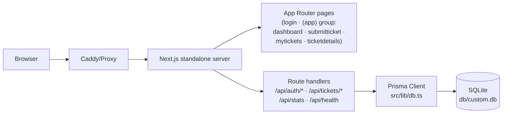

# ServiceDesk — IT Support Portal


A production-ready IT support ticketing portal — a feature-parity **superset** clone of the [base44 ServiceDesk reference app](https://service-desk-332a5ae4.base44.app/), rebuilt on Next.js 16 + React 19 + Prisma/SQLite. Users sign in, submit tickets across six issue categories, track status/priority, converse in comment threads, and manage their own ticket lifecycle.

## Overview

The portal solves a everyday enterprise problem: employees need a single place to report IT issues (hardware, software, network, access, email) and follow them to resolution, while the sidebar keeps live global stats visible. The clone reproduces the reference app's visual design (measured from its live DOM and computed styles — not guessed) and extends it with a working signup flow, password-reset request, file attachments, owner-side status control, search/filter/sort, and a full test pyramid.

**Verification status:** `lint` ✓ · `typecheck` ✓ · 50 Vitest unit tests ✓ · production build ✓ · 46 Playwright E2E tests ✓ · API smoke script ✓

## Key Features

| Feature | Description |
|---|---|
| 🎫 **Ticket lifecycle** | Submit → open → in progress → resolved → closed, with owner-side status control |
| 🔐 **Cookie sessions** | HMAC-SHA256 signed sessions, scrypt password hashing, per-IP rate limiting |
| 🗂️ **Six categories** | Hardware / Software / Network / Access / Email / Other, each with an emoji tile |
| ⚡ **Four priorities** | Low / Medium / High / Urgent, sortable and filterable |
| 💬 **Comments** | Threaded updates per ticket with author + timestamp |
| 📎 **Attachments** | Images/PDFs/documents up to 2 MB each, 3 per ticket, streamed downloads |
| 🔍 **Search & filters** | Full-text search, status/priority filters, newest/oldest/priority sort, My/All scope |
| 📊 **Live stats** | Sidebar quick stats (global) + dashboard cards (yours) + average resolution time |
| 📱 **Responsive chrome** | shadcn/ui off-canvas mobile sidebar with overlay, Escape, and auto-close on navigate |
| 🎨 **Parity-pinned design** | 18 E2E parity tests pin the reference's measured classes (gradient quick stats, flat recent rows, detail grid, login card) |
| 🧪 **Test pyramid** | 50 unit + 46 E2E tests + API smoke, pinned to the UI contract |

## Architecture

| Layer | Technology | Version | Purpose |
|---|---|---|---|
| Framework | Next.js (App Router, standalone output) | 16.4.0 | Server rendering, route handlers, route-group auth guard |
| UI runtime | React | 19.3.0 | Client islands inside server-rendered chrome |
| Language | TypeScript (strict) | 5.9.3 | Type safety across app and tests |
| Styling | Tailwind CSS (CSS-first `@theme inline`) | 4.3.3 | Utility styling; semantic tokens resolve `:root` vars |
| Components | shadcn/ui on Radix primitives | — | Sidebar/Sheet/Select/Tooltip/Toast/etc. |
| ORM | Prisma + SQLite | 6.19.3 | `User` / `Ticket` / `Comment` / `Attachment` at `db/custom.db` |
| Auth | Custom HMAC cookie + scrypt | — | Zero third-party auth surface; auditable in `src/lib/auth.ts` |
| Unit tests | Vitest | 5.0.3 | Pure domain seams: auth, validation, db-path, utils |
| E2E tests | Playwright (Chromium) | 1.64.0 | Production standalone server + isolated `db/e2e.db` |



## File Hierarchy

```
📂 service-desk/
├── 📂 src/
│   ├── 📂 app/
│   │   ├── 📂 (app)/                  ← authenticated route group (layout guards session)
│   │   │   ├── 📂 dashboard/          ← stat cards, performance metrics, recent tickets (flat rows)
│   │   │   ├── 📂 submitticket/       ← ticket form + attachments
│   │   │   ├── 📂 mytickets/          ← search/filter/sort/scope list (max-w-7xl, 3-col filter grid)
│   │   │   └── 📂 ticketdetails/      ← 3-col grid: gradient-header card + comments + info panel
│   │   ├── 📂 api/                    ← route handlers (auth, tickets, comments, stats, health)
│   │   ├── 📂 login/ · signup/ · forgotpassword/
│   │   ├── layout.tsx · page.tsx · globals.css
│   ├── 📂 components/
│   │   ├── 📂 ui/                     ← shadcn primitives (sidebar, sheet, select, toast, …)
│   │   ├── app-sidebar.tsx            ← nav + gradient quick stats + user footer
│   │   ├── app-sidebar-chrome.tsx     ← provider tree + gradient wrapper + mobile header + scroll container
│   │   ├── ticket-bits.tsx            ← badges + ticket card + flat recent-ticket row
│   │   └── toast.tsx                  ← Radix toast + useToast context
│   ├── 📂 hooks/use-mobile.ts         ← useSyncExternalStore media query
│   └── 📂 lib/                        ← auth, db, db-path, validation, constants, utils (+ tests)
├── 📂 prisma/schema.prisma · seed.ts
├── 📂 db/                             ← SQLite file lives here (gitignored *.db)
├── 📂 tests/e2e/                      ← Playwright specs (incl. visual-parity.spec.ts) + setup + global setup
├── 📂 scripts/                        ← smoke-test.sh + gradient probes
├── 📂 docs/                           ← deployment, Tailwind v4 report, remediation plan, screenshots, ssh push skill
├── 📂 public/                         ← logo.png (reference app logo) + robots.txt
└── next.config.ts · vitest.config.ts · playwright.config.ts
```

## Quick Start

Requires **Node.js ≥ 20** (or Bun ≥ 1.1) and Python ≥ 3.9 for the seed's crypto imports.

```bash
git clone https://github.com/nordeim/service-desk.git
cd service-desk
bun install                # or: npm install

cp .env.example .env       # defaults: DATABASE_URL="file:../db/custom.db"
# generate a session secret (REQUIRED in production):
#   python3 -c "import secrets; print(secrets.token_hex(32))"   → AUTH_SECRET

bun run db:push            # create db/custom.db from prisma/schema.prisma
bun run db:seed            # demo corpus: 4 users, 11 tickets, 3 comments

bun run dev                # http://localhost:3000
```

**Demo login:** `demo@servicedesk.app` / `Demo1234!`

### Verify Setup

```bash
curl http://localhost:3000/api/health
# {"status":"ok","db":"up","time":"..."}          ← server + database healthy

bun run lint && bun run typecheck && bun run test
# ESLint clean · tsc clean · 4 files / 50 tests passed
```

## Environment Variables

| Variable | Required | Purpose |
|---|---|---|
| `DATABASE_URL` | yes | SQLite path, **relative to `prisma/schema.prisma`**. Keep `file:../db/custom.db` → resolves to `<repo>/db/custom.db` for CLI, dev, build, and the standalone server (see `src/lib/db-path.ts`). Production recommends an absolute path. |
| `AUTH_SECRET` | prod | HMAC signing key for session cookies (`openssl rand -hex 32`). Falls back to an insecure dev constant with a loud warning. |
| `NEXT_PUBLIC_SITE_URL` | no | Canonical origin for metadata (default `http://localhost:3000`). |

> **Gotcha:** the npm scripts pin `DATABASE_URL='file:../db/custom.db'` inline. An ambient `DATABASE_URL` env var (e.g. from a sandbox) would otherwise override `.env` and redirect the database; the inline pin makes every script deterministic.

## Testing

```bash
bun run test               # Vitest unit: 50 tests (auth HMAC/scrypt/rate-limit, validation, db-path, utils)
bun run test:e2e           # Playwright E2E (46 tests): builds nothing — boots the PRODUCTION standalone server
                           # on :3100 with an isolated db/e2e.db (schema pushed + seeded by global setup)
bash scripts/smoke-test.sh # API surface against a throwaway standalone server on :3999
```

E2E notes: the suite signs the demo user in **once** (setup project → saved `storageState`) because the auth endpoints are rate-limited (10 attempts/IP/15 min). `tests/e2e/auth.spec.ts` opts out of the shared session to test the logged-out surface. The mobile-navigation spec pins the off-canvas sheet contract (open, overlay close, Escape close, auto-close on navigate, desktop gradient parity). `tests/e2e/visual-parity.spec.ts` (18 tests) pins the session-2 remediation contracts measured from the live reference: gradient quick-stats rows, flat divide-y recent tickets, the detail page's `lg:grid-cols-3` layout with gradient card header, `text-4xl` page headings, the non-sticky mobile header, and the login card shell (`max-w-md`, `backdrop-blur-sm`, `ring-4` logo).

## API Reference

| Endpoint | Method | Auth | Description |
|---|---|---|---|
| `/api/auth/login` | POST | — | Email + password → session cookie |
| `/api/auth/signup` | POST | — | Create account → session cookie |
| `/api/auth/logout` | POST | — | Clear session cookie |
| `/api/auth/me` | GET | — | Current user (401 when signed out) |
| `/api/auth/forgot-password` | POST | — | Reset request (generic response; no account enumeration) |
| `/api/tickets` | GET | ✓ | List (filters: `search`, `status`, `priority`, `sort`, `scope=mine\|all`) |
| `/api/tickets` | POST | ✓ | Create ticket (+ optional base64 attachments) |
| `/api/tickets/[id]` | GET | ✓ | Ticket detail with comments + attachments |
| `/api/tickets/[id]` | PATCH | ✓ | Owner-only status transition ⚠️ |
| `/api/tickets/[id]/comments` | POST | ✓ | Add comment (touches ticket `updatedAt`) |
| `/api/tickets/[id]/attachments/[attachmentId]` | GET | ✓ | Stream attachment (safe Content-Disposition) |
| `/api/stats` | GET | ✓ | Mine + global counts, average resolution time |
| `/api/health` | GET | — | Liveness + DB readiness probe |

## Design System

Measured from the reference app (computed styles + extracted `:root` variables):

| Token | Hex | Usage |
|---|---|---|
| `--background` | `#f8fafc` | Page base (slate-50) |
| `--sidebar` | `#fafafa` | Sidebar panel — **not** white (measured) |
| `--primary` / `--ring` | `#0891b2` / `#06b6d4` | Cyan accents, focus rings |
| `--navy-950 … 800` | `#0a1628` / `#0f2744` / `#1a3a5c` | Dark surfaces (login badge, dark theme) |
| `--amber-500` | `#f59e0b` | "Open" stat badge |
| `--emerald-500` | `#10b981` | "Resolved" accent |

- **Typography:** Inter (next/font), tight tracking on headings (`tracking-tight`); page h1s are `text-4xl` with `text-lg text-slate-600` subtitles (reference scale, session 2).
- **Signature motif:** `bg-gradient-to-r from-cyan-500 to-blue-600` — active nav, primary buttons; icon tiles and card headers use per-context gradients (violet→purple, amber→orange, blue→cyan, emerald→green; card headers cyan-50/50→blue-50/50).
- **Quick stats:** gradient rows `from-amber-50 to-orange-50` / `from-blue-50 to-cyan-50` / `from-slate-50 to-gray-50` with `shadow-md` value badges — geometry verified identical to the reference (48 px rows, 16 px group offset, 14 px labels).
- **Login card:** `max-w-md`, `bg-white/95 backdrop-blur-sm shadow-2xl` with a slate gradient top bar and an in-card `ring-4` logo circle; inputs `bg-slate-50/50` (focus `border-slate-400`), sign-in button `bg-slate-900`.
- **Motion:** 300–500 ms `transition-all` on cards/links; sheet slide-in 500 ms; hover lift + arrow slide on ticket cards (mytickets rows only — dashboard recent rows are flat).

## Deployment

See **[docs/DEPLOYMENT.md](docs/DEPLOYMENT.md)** for the full guide (standalone build, absolute `DATABASE_URL` in production, reverse-proxy notes). Summary:

```bash
bun install
bun run build              # .next/standalone/server.js + static + public
AUTH_SECRET=$(openssl rand -hex 32) DATABASE_URL="file:$PWD/db/custom.db" \
  NODE_ENV=production bun .next/standalone/server.js
```

## Contributing

- **TDD flow:** red → green → refactor for domain logic (`src/lib/**` seams are unit-tested; the UI contract is E2E-pinned).
- **Conventions that differ from defaults:** React 19 (no `forwardRef`), Tailwind v4 CSS-first config (no `tailwind.config.js` — semantic tokens use `@theme inline`; a bare `@theme` with `var()` chains is dropped by the build), `cookies()`/`params`/`searchParams` are async in Next 16.
- **Gates before every commit:** `bun run lint && bun run typecheck && bun run test && bun run build`.
- Commits follow Conventional Commits; one logical change per commit.

## License

Private project — all rights reserved by the repository owner.
